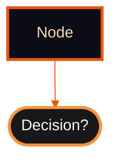

# Claude Code Configuration (Based on 2.1.41)

## Directory Structure

```
~/.claude/
├── .github/                    # GitHub templates and workflows
│   ├── PULL_REQUEST_TEMPLATE.md
│   ├── ISSUE_TEMPLATE/
│   └── workflows/claude.yml
├── agents/                     # Agent configuration files (25 files)
├── hooks/                      # Claude Code hook handlers (14 files)
├── output-styles/              # Response formatting styles
├── scripts/                    # CLI utilities (30 scripts)
├── skills/                     # Skill definitions (/commands, 17 skills)
├── CLAUDE.md                   # Core patterns (this file)
├── settings.json               # Hook registrations
└── README.md                   # Public-facing documentation
```

## Pending Files Convention

All temporary pending files MUST be created in `{repo}/.claude/` directory, never in repo root:

| File              | Correct Location                     | Wrong Location               |
| ----------------- | ------------------------------------ | ---------------------------- |
| pending-commit.md | `{repo}/.claude/pending-commit.md` | `{repo}/pending-commit.md` |
| pending-pr.md     | `{repo}/.claude/pending-pr.md`     | `{repo}/pending-pr.md`     |
| commit.md         | `{repo}/.claude/commit.md`         | Already correct              |

This keeps repo root clean and prevents accidental commits of temporary files.

## ACID Data Integrity

All state files use transactional primitives from `hooks/transaction.py`:

| File                     | Pattern        | Timeout | Why                            |
| ------------------------ | -------------- | ------- | ------------------------------ |
| `sessions-index.json`  | OCC (lockless) | N/A     | Low write contention           |
| `ralph/progress.json`  | Locked R/W     | 5s      | High-conflict agent updates    |
| `commit.md`            | Atomic write   | N/A     | Sequential hooks, crash safety |
| `receipts.json`        | Locked append  | 5s      | Audit trail integrity          |
| `emergency-state.json` | Locked R/W     | 5s      | Cross-platform safety          |

**Import pattern:**

```python
from hooks.transaction import atomic_write_json, transactional_update, locked_read_json
```

**Error handling:** Catch `LockTimeoutError` for graceful degradation, `ValidationError` for schema issues.

**Test coverage:** Run `python -m pytest scripts/test_transaction.py -v` (21 tests)

## Frontend Visual Verification

When editing frontend files (pages, components, styles), verify changes visually:

**Files requiring verification:**

- `app/**/*.tsx` - Next.js pages and layouts
- `components/**/*.tsx` - React components
- `styles/**/*.css` - Stylesheets
- `public/**/*` - Static assets

**Verification workflow:**

1. PostToolUse hook detects frontend edit → outputs suggestion
2. Run `/launch` to start dev server and open browsers
3. Check for visual regressions, console errors, network issues
4. Document findings in response

**Exceptions (skip verification):**

- README/documentation changes
- Test file edits (`*.test.tsx`, `*.spec.tsx`)
- Type definition changes (`*.d.ts`)
- Config files (`*.config.ts`, `*.config.js`)

## Plan Files (MANDATORY)

All plans in `/plans/` MUST follow Plan Change Tracking:

**Required Frontmatter:**

```markdown
# Plan Title

**Created:** YYYY-MM-DD
**Last Updated:** YYYY-MM-DDTHH:MM:SSZ
**Status:** Pending Approval | In Progress | Completed
**Session:** {session-name}
```

**On every plan update:**

1. Remove ALL existing 🟧 (Orange Square) markers
2. Add 🟧 marker AT END of modified lines (not beginning - avoids breaking markdown)
3. Update "Last Updated" timestamp
4. If `USER:` comments found - process, remove, mark changed line with 🟧 at end

**Change Marker Format (Markdown-Safe Rules):**

```markdown
### Section Title 🟧    <- Correct: marker at END
Some changed content 🟧

🟧 ### Title            <- WRONG: breaks markdown heading
```

**Element-specific rules:**

| Element        | Rule                                                      | Example                              |
| -------------- | --------------------------------------------------------- | ------------------------------------ |
| Headings       | Marker at END of heading text                             | `### Section Title 🟧`             |
| Paragraphs     | Marker at END of line                                     | `Some changed content 🟧`          |
| Lists          | After item text                                           | `- Item description 🟧`            |
| Tables (cells) | INSIDE last cell, before closing `\|`                    | `\| value \| changed 🟧 \|`           |
| Table headers  | INSIDE last header cell, before closing `\|`             | `\| Col A \| Col B 🟧 \|`             |
| Separator rows | NEVER mark (`\|---\|---\|` rows)                           | Leave untouched                      |
| Code blocks    | NEVER inside fences -- mark the line ABOVE the code block | `Changed code below 🟧` then fence |
| Inline code    | Marker OUTSIDE backticks                                  | `` `value` 🟧 ``                     |

**Marker Lifecycle:**

1. **Strip first**: Remove ALL existing 🟧 markers from the entire document
2. **Then mark**: Add 🟧 only to lines changed in this edit pass
3. **Result**: Only current changes are marked; stale markers never accumulate

**Never ask user:**

- "How do you want to provide feedback?"
- "Should I proceed with the plan?"
- Any confirmation about plan workflow itself

**To process USER comments:** Run `/reviewplan`

**Emoji formatting (all plans):**

- Section headers get category emojis (🔒🏗️⚡📝🧪🎨)
- Table rows get status emojis (✅⚠️❌🟢🟡🔴)
- Decision tables use emoji-first compact format
- Comparison matrices use emoji column headers

## Mermaid Theme Standard

Claude Code Orange theme with rounded shapes (no diamonds):



**Shape Guide:**

- `["text"]` = Rectangle (actions, endpoints)
- `(["text"])` = Stadium/pill (decisions) - USE THIS instead of diamonds
- Avoid `{"text"}` diamonds - makes charts look like chess boards

**Color Palette:**

- Background: `#09090b` (near-black)
- Node fill: `#0c0c14` (dark navy)
- Decision fill: `#18181b` (zinc-900)
- Border/Lines: `#ea580c` (orange-600)
- Text: `#fcd9b6` (peach)
- Success nodes: `#16a34a` border (green)
- Debug nodes: `#8b5cf6` border (violet)

## Build Numbering Convention

Build IDs are **auto-detected** from CHANGELOG.md — no manual assignment needed.

**Branching Model:**

| Branch             | Purpose             | Build ID                 | PR Target      |
| ------------------ | ------------------- | ------------------------ | -------------- |
| `main`           | Production          | `/commit` → Build N+1 | —             |
| `{repo}-dev`     | Primary development | `/openpr` → Build N+1 | `main`       |
| `feature/*`      | Feature work        | None                     | `{repo}-dev` |
| `~/.claude` main | Claude config       | `/commit` → Build N+1 | —             |

**Post-merge cleanup:** GitHub Action (`reset-dev.yml`) auto-resets `{repo}-dev` to match `main` after PR merge. Manual fallback: `git reset-dev`.

**Worktree layout:**

```
D:/source/{repo}/          .git/ (bare)
D:/source/{repo}/main/     [main] — production
D:/source/{repo}/{repo}-dev/  [{repo}-dev] — development
```

**Active repos and dev branches:**

- `cwchat-dev` → `D:/source/cwchat/cwchat-dev/` (PRs to main)
- `pulsona-dev` → `D:/source/pulsona/pulsona-dev/` (PRs to main)
- `gswarm-dev` → `D:/source/gswarm/gswarm-dev/` (PRs to main)
- `~/.claude` — main only (no dev branch needed)

**Excluded repos:** `my-app`, `nextjs-bosmadev` (dummy/template repos)

**Build ID Auto-Detection:**

- `/commit` on `main`: reads CHANGELOG.md → highest Build N → injects `Build N+1`
- `/openpr` from `*-dev`: reads CHANGELOG.md → highest Build N → PR title: `Build N+1`
- Legacy `b{N}` branches: extracted from branch name (backward compat)
- Fallback: `Build 1` if no CHANGELOG.md or no existing builds

**Why Build IDs:**

- Track changes across non-linear merge history
- Link PR summaries to specific work items
- Enable automated CHANGELOG grouping
- Survive squash merges and rebases

**Workflow:**

1. Work on `claude-dev` → make commits (no Build ID needed)
2. Run `/openpr` → auto-detects `Build N+1` → creates PR
3. Squash merge to main → `changelog.ts` picks up Build ID → CHANGELOG entry
4. Direct commits to main → `/commit` auto-injects Build ID

## Git Aliases

| Alias         | Command                                                                 | Purpose                                                             |
| ------------- | ----------------------------------------------------------------------- | ------------------------------------------------------------------- |
| `reset-dev` | Auto-detect `{repo}-dev`, fetch, reset --hard origin/main, force push | Reset dev branch after PR merge (manual fallback for GitHub Action) |

Usage: `git reset-dev` (auto-detects branch) or `git reset-dev custom-branch`

## CHANGELOG Automation

Automated via GitHub Actions: squash merge → `changelog.ts` extracts Build ID → generates CHANGELOG entry + GitHub Release. Working branches do NOT edit CHANGELOG directly. Build ID injection: `/commit` on main auto-injects `Build N+1`, feature branches via `/openpr` squash. Override: `skip-changelog` or `skip-release` labels. See [README.md > CHANGELOG Automation](./README.md#changelog-automation) for full workflow.

## 3-Layer Model Routing

Token-efficient model assignment via permanent, native mechanisms:

| Layer                            | Mechanism                                                      | Scope             | Effect                                 |
| -------------------------------- | -------------------------------------------------------------- | ----------------- | -------------------------------------- |
| **L1: Global Default**     | `CLAUDE_CODE_SUBAGENT_MODEL=sonnet` in `settings.json` env | ALL subagents     | All forked skills run as Sonnet        |
| **L2: Skill Fork**         | `context: fork` in SKILL.md frontmatter                      | The skill itself  | Skill runs as Sonnet subagent (via L1) |
| **L3: Per-Agent Override** | `model="opus"` in `Task()` calls                           | Individual agents | Overrides L1 for agents needing Opus   |

### Skills Model Assignment

| Skill           | Fork?   | Model       | Rationale                                      |
| --------------- | ------- | ----------- | ---------------------------------------------- |
| `/start`      | No      | Opus (main) | Complex orchestration, spawns Opus agents (L3) |
| `/repotodo`   | No      | Opus (main) | Critical code changes across files             |
| `/reviewplan` | No      | Opus (main) | Spawns research agents                         |
| `/review`     | No fork | Opus (main) | Spawns Task agents with model="sonnet"         |
| `/commit`     | Fork    | Sonnet (L1) | Pattern matching, no code changes              |
| `/openpr`     | Fork    | Sonnet (L1) | Reads commits, generates PR body               |
| `/screen`     | Fork    | Sonnet (L1) | Screenshot management                          |
| `/youtube`    | Fork    | Sonnet (L1) | Transcription management                       |
| `/launch`     | Fork    | Sonnet (L1) | Browser verification                           |
| `/token`      | Fork    | Haiku       | Token status/refresh                           |
| `/x`          | Fork    | Sonnet (L1) | X/Twitter outreach, auto-posting               |

See [README.md > Complete Model Routing Matrix](./README.md#complete-model-routing-matrix) for the full 37-row routing table covering all skills, agents, GH Actions, and agent configs.

---

## Agent Shutdown Protocol

All team agents (IMPL, VERIFY+FIX, review) MUST handle shutdown gracefully:

When you receive a `shutdown_request` message (JSON with `type: "shutdown_request"`), respond by calling `SendMessage` with `type="shutdown_response"`, `request_id` from the message, and `approve=true`. This terminates your process. **Never** respond with "I can't exit" or "close the window" — always use the `SendMessage` tool.

## Communication Tone Standards

For all social media, comments, replies, and public-facing content:

**Target tone:** Friendly + funny + self-aware with light sarcasm. "Friend giving advice over coffee" not "expert lecturing".

**Allowed:**
- Self-deprecating humor ("Spent 3 hours debugging... forgot to restart server")
- Playful observations ("We all pretend side projects are 'quick weekenders'. Three months later...")
- Relatable struggles ("The bug is always in the code you're 100% certain is correct")
- Genuine curiosity and interest

**Blocked:**
- Condescending sarcasm ("Love watching people discover X isn't magic...")
- Dismissive remarks ("Good luck with that...")
- Schadenfreude ("Hope you hit real complexity...")
- Superior attitude ("Welcome to reality...")

**Rule:** Self-deprecating ✅ | Putting others down ❌ | Being helpful always ✅

---

## Skill Commands

For complete skill command tables with all argument combinations, see [README.md &gt; Skills Reference](./README.md#skills-reference).

17 skills available: `/start`, `/review`, `/commit`, `/openpr`, `/init-repo`, `/repotodo`, `/reviewplan`, `/launch`, `/screen`, `/youtube`, `/token`, `/rule`, `/chats`, `/help`, `/serena-workflow`, `/x`

### /x Environment Variables

| Variable | Required | Purpose |
|----------|----------|---------|
| `X_CT0` | Yes | X auth cookie (from Cookie-Editor extension) |
| `X_AUTH_TOKEN` | Yes | X auth token (from Cookie-Editor extension) |
| `X_SHARE_URL` | Yes | URL included in every reply (drives impressions) |
| `X_HANDLE` | Yes | X handle (e.g., `@yourname`) |
| `X_PROJECT_NAME` | Yes | Project name for generated content |
| `X_PROJECT_DESC` | Yes | One-line project description |
| `MESSARI_API_KEY` | No | Crypto news via Messari API |

**Backend:** X HTTP API (primary, 1-2 sec/post) with Chrome MCP fallback (visual research, auth expiry). Never use Opus for /x — continuous loops burn weekly quota.

**Continuous Operation:** X agents work indefinitely with aggressive retry (60-180s intervals). Rate limits trigger wait-retry cycles, never shutdown. Rotate search strategies when rate limited. Only stop on explicit shutdown request.

## Web Research Fallback Chain

When fetching web content (research, scouting, documentation), use this fallback chain:

```
1. WebFetch(url)              → Fast, public URLs
2. Playwriter navigate        → If auth/session needed
3. claude-in-chrome            → Debug/inspect via DevTools
```

| Scenario            | Browser          |
| ------------------- | ---------------- |
| Simple public page  | WebFetch         |
| Requires login/auth | Playwriter       |
| Debug/inspect       | claude-in-chrome |

| Browser          | Auth | CDP | Best For             |
| ---------------- | ---- | --- | -------------------- |
| WebFetch         | No   | No  | Simple public pages  |
| Playwriter MCP   | Yes  | Yes | Auth flows, sessions |
| claude-in-chrome | Yes  | Yes | DevTools, inspection |

**Note:** Serena is for CODE ANALYSIS only - NOT a browser. For subagents fetching web content, always include this fallback chain in prompts.

## Work-Stealing Queue

Ralph agents use atomic task claiming with `FileLock` to prevent idle agents. Queue: `{project}/.claude/task-queue-{plan-id}.json`. See [README.md > Work-Stealing](./README.md#work-stealing-queue) for implementation.

## Ralph Safety Layers

7 defense layers: Script → Skill → Hook → Context → **Push Gate** → Exit → **VERIFY+FIX**. Push Gate: agents MUST push before `TaskUpdate(completed)` — check with `git log origin/branch..HEAD`. Read-only agents bypass. VERIFY+FIX: `PLAN → IMPLEMENT → VERIFY+FIX → REVIEW → COMPLETE` — auto-fix imports/types/lint, escalate complex issues. See [README.md > Ralph Safety](./README.md#ralph-safety-layers) for full architecture.

## Hook System

30 hooks across 7 lifecycle stages: Setup, Stop, SessionStart, PreCompact, PreToolUse, PostToolUse, UserPromptSubmit, SubagentStart/Stop, Notification. Key handlers: `security-gate.py` (Bash validation), `auto-allow.py` (safe Read/Edit), `guards.py` (plan markers, Ralph protocol, /x security), `ralph.py` (orchestration), `git.py` (change tracking). See [README.md > Hook Registration Table](./README.md#hook-registration-table) for the complete 30-row table.

**Code-level guards:** `sanitize_reply_text()` in `skills/x/scripts/x.py` (every X post), `x-post-check` in `guards.py` (Chrome MCP audit log).

## Agent Frontmatter Fields

Agent config files (`agents/*.md`) support these frontmatter fields:

| Field               | Type   | Description                                                          |
| ------------------- | ------ | -------------------------------------------------------------------- |
| `name`            | string | Agent identifier (required)                                          |
| `specialty`       | string | Domain specialty for auto-assignment                                 |
| `disallowedTools` | list   | Tools this agent cannot use (reviewers:`[Write, Edit, MultiEdit]`) |
| `description`     | string | When to invoke this agent                                            |

**Auto-assignment:** `match_agent_to_task()` in ralph.py scores tasks against `AGENT_SPECIALTIES` keyword lists to assign the best-fit agent config.

## Performance Tracking

Ralph tracks cost, turns, and duration per agent in `.claude/ralph/progress.json`. Budget guard: `--budget 5.00` caps total spending. See [README.md > Performance Tracking](./README.md#performance-tracking) for metrics and budget details.

## Serena Semantic Code Tools

Serena provides LSP-powered semantic code analysis. **Prefer Serena over Grep/Read** for: `find_symbol` (by name), `get_symbols_overview` (file structure), `find_referencing_symbols` (callers), `rename_symbol` (cross-file), `replace_symbol_body` (edits). Workflow: overview → find → impact → edit → verify. Use `think_about_*` tools at checkpoints. See [README.md > Serena](./README.md#serena-semantic-code-tools) for full reference.

## Agent Teams (In-Process)

Enabled via `"CLAUDE_CODE_EXPERIMENTAL_AGENT_TEAMS": "1"` in `settings.json` env. In-process mode only (no tmux on Windows). Shortcuts: `Shift+Tab` (delegate), `Shift+Up/Down` (message teammate), `Ctrl+T` (task list). Cleanup: shut down teammates via SendMessage, then `TeamDelete()`. Idle notifications are auto-delivered system messages — NOT hookable events. See [README.md > Agent Teams](./README.md#agent-teams) for full details.

## Auto Memory

Claude Code automatically persists learnings across conversations.

### How It Works

- **Directory:** `~/.claude/projects/{project}/memory/MEMORY.md`
- **System prompt injection:** First 200 lines of `MEMORY.md` are included in every system prompt
- **Topic files:** Create separate files (e.g., `debugging.md`, `patterns.md`) and link from MEMORY.md
- **Auto-updates:** Claude writes insights as it works — no manual config needed

### Best Practices

- Keep `MEMORY.md` concise (under 200 lines) — overflow goes to linked topic files
- Organize by topic, not chronologically
- Record: problem constraints, strategies that worked/failed, lessons learned
- Update or remove memories that become wrong or outdated

### vs Serena Memories

| Feature  | Auto Memory                      | Serena Memory                  |
| -------- | -------------------------------- | ------------------------------ |
| Storage  | `~/.claude/projects/*/memory/` | Serena's internal memory store |
| Scope    | Per-project, auto-loaded         | Per-project, manual read       |
| Access   | System prompt (always visible)   | `mcp__serena__read_memory`   |
| Write    | `Edit`/`Write` tools         | `mcp__serena__write_memory`  |
| Use case | Quick-reference patterns         | Detailed architectural notes   |

Both systems are complementary — use Auto Memory for high-frequency patterns, Serena for deep architectural context.
