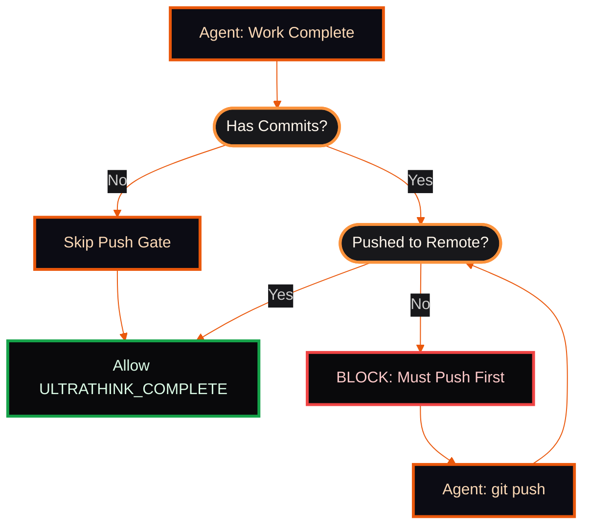

# Claude Code Configuration

#### Based on claude-code: 2.1.31

**Stack:** Next.js 16.1+, React 19+, Node.js 25+, Python 3.14+, FastAPI, TypeScript 5.9.3+, Tailwind CSS v4+, Shadcn UI, Radix, Playwright, Vitest, Biome 2.3.10+, Knip 5.77.1+, uv 0.9.18+, pnpm 10.26.2+.

**Build:** `pnpm build` | **Validate:** `pnpm validate`

## Directory Structure

```
~/.claude\
├── .github\                    # GitHub templates and workflows
│   ├── PULL_REQUEST_TEMPLATE.md
│   ├── ISSUE_TEMPLATE\
│   │   ├── bug_report.md
│   │   └── feature_request.md
│   └── workflows\claude.yml
├── agents\                     # Agent configuration files
│   ├── api-reviewer.md
│   ├── build-error-resolver.md
│   ├── commit-reviewer.md
│   ├── verify-fix.md          # Verify+Fix phase agent
│   └── ... (20 files total)
├── hooks\                      # Claude Code hook handlers
│   ├── guards.py              # Skill parser, plan validation
│   ├── ralph.py               # Ralph protocol hooks (wrapper)
│   ├── git.py                 # Git safety hooks
│   └── utils.py               # Shared desktop utilities
├── output-styles\              # Response formatting styles
│   └── Engineer.md            # Dense technical output
├── scripts\                    # CLI utilities
│   ├── statusline.py          # Terminal status display
│   ├── ralph.py               # Ralph unified implementation
│   ├── claude-github.py       # GitHub integration
│   └── aggregate-pr.py        # PR commit aggregation
├── skills\                     # Skill definitions (/commands)
│   ├── commit\                # /commit - Git commits
│   ├── init-repo\             # /init-repo - Repo initialization
│   ├── launch\                # /launch - Browser debug
│   ├── openpr\                # /openpr - Pull requests
│   ├── quality\               # /quality - Linting/checks
│   ├── repotodo\              # /repotodo - TODO processor
│   ├── review\                # /review - Code review
│   ├── reviewplan\            # /reviewplan - Plan comments
│   ├── screen\                # /screen - Screenshots
│   ├── serena-workflow\       # /serena-workflow - Serena guide
│   ├── start\                 # /start - Ralph autonomous dev
│   ├── token\                 # /token - Token management
│   └── youtube\               # /youtube - Transcriptions
├── CLAUDE.md                   # Main configuration
├── settings.json               # Hook registrations
└── README.md                   # Documentation
```

## Pending Files Convention

All temporary pending files MUST be created in `{repo}/.claude/` directory, never in repo root:

| File              | Correct Location                     | Wrong Location               |
| ----------------- | ------------------------------------ | ---------------------------- |
| pending-commit.md | `{repo}/.claude/pending-commit.md` | `{repo}/pending-commit.md` |
| pending-pr.md     | `{repo}/.claude/pending-pr.md`     | `{repo}/pending-pr.md`     |
| commit.md         | `{repo}/.claude/commit.md`         | Already correct              |

This keeps repo root clean and prevents accidental commits of temporary files.

## Plan Files (MANDATORY)

All plans in `/plans/` MUST follow Plan Change Tracking:

**Required Frontmatter:**

```markdown
# Plan Title

**Created:** YYYY-MM-DD
**Last Updated:** YYYY-MM-DDTHH:MM:SSZ
**Status:** Pending Approval | In Progress | Completed
```

**On every plan update:**

1. Remove ALL existing 🟧 (Orange Square) markers
2. Add 🟧 marker AT END of modified lines (not beginning - avoids breaking markdown)
3. Update "Last Updated" timestamp
4. If `USER:` comments found - process, remove, mark changed line with 🟧 at end

**Change Marker Format (Markdown-Safe Rules):**

```markdown
### Section Title 🟧    <- Correct: marker at END
Some changed content 🟧

🟧 ### Title            <- WRONG: breaks markdown heading
```

**Element-specific rules:**

| Element        | Rule                                                      | Example                              |
| -------------- | --------------------------------------------------------- | ------------------------------------ |
| Headings       | Marker at END of heading text                             | `### Section Title 🟧`             |
| Paragraphs     | Marker at END of line                                     | `Some changed content 🟧`          |
| Lists          | After item text                                           | `- Item description 🟧`            |
| Tables (cells) | INSIDE last cell, before closing `\|`                    | `\| value \| changed 🟧 \|`           |
| Table headers  | INSIDE last header cell, before closing `\|`             | `\| Col A \| Col B 🟧 \|`             |
| Separator rows | NEVER mark (`\|---\|---\|` rows)                           | Leave untouched                      |
| Code blocks    | NEVER inside fences -- mark the line ABOVE the code block | `Changed code below 🟧` then fence |
| Inline code    | Marker OUTSIDE backticks                                  | `` `value` 🟧 ``                     |

**Marker Lifecycle:**

1. **Strip first**: Remove ALL existing 🟧 markers from the entire document
2. **Then mark**: Add 🟧 only to lines changed in this edit pass
3. **Result**: Only current changes are marked; stale markers never accumulate

**Never ask user:**

- "How do you want to provide feedback?"
- "Should I proceed with the plan?"
- Any confirmation about plan workflow itself

**To process USER comments:** Run `/reviewplan`

**Emoji formatting (all plans):**

- Section headers get category emojis (🔒🏗️⚡📝🧪🎨)
- Table rows get status emojis (✅⚠️❌🟢🟡🔴)
- Decision tables use emoji-first compact format
- Comparison matrices use emoji column headers

## Token Refresh (4-Layer Defense)

Token refresh uses defense-in-depth with 4 layers to survive laptop shutdown/sleep:

```
┌─────────────────────────────────────────────────────────────────┐
│                     TOKEN REFRESH LAYERS                        │
├─────────────────────────────────────────────────────────────────┤
│ Layer 1: Task Scheduler  → Every 30 min, "Start when available" │
│ Layer 2: Resume Trigger   → Power resume event trigger          │
│ Layer 3: Login Profile    → Check on PowerShell profile load    │
│ Layer 4: Pre-op Check     → Validates before Claude operations  │
└─────────────────────────────────────────────────────────────────┘
```

**Token Lifetimes:**

- Access token: ~2 hours
- Refresh token: ~1 year

**Morning Workflow:**

1. Wake from sleep → Layer 2 triggers refresh (5s delay for network)
2. Open PowerShell → Layer 3 runs background check via profile
3. Start Claude → Layer 4 validates before first operation
4. Task Scheduler catches up → Layer 1 continues 30-min cycle

**Scripts:**

| Script                              | Purpose                                           |
| ----------------------------------- | ------------------------------------------------- |
| `scripts\claude-github.py`        | Main token management (status/refresh/sync)       |
| `scripts\refresh-claude-token.py` | Wrapper for Task Scheduler (handles network wait) |
| `scripts\token-guard.py`          | Pre-operation validation (Layer 4)                |
| `scripts\install-token-timer.py`  | Install Task Scheduler entries                    |

**Troubleshooting:**

| Issue               | Solution                                                                        |
| ------------------- | ------------------------------------------------------------------------------- |
| Token expired       | Run:`python ~/.claude\scripts\claude-github.py refresh --force` |
| Timer not running   | Check:`schtasks /Query /TN "ClaudeTokenRefresh"`                              |
| Resume hook missing | Run:`schtasks /Create /TN "ClaudeTokenResume" /SC ONEVENT /EC System`         |
| Manual refresh      | Run:`claude auth login`                                                       |
| Debug logs          | View:`%USERPROFILE%\.claude\debug\token-refresh.log`                          |
| Check all layers    | Run:`schtasks /Query /TN "ClaudeToken*"`                                      |

## Web Research Fallback Chain

When fetching web content (research, scouting, documentation), use this fallback chain:

```
1. WebFetch(url)              → Fast, public URLs
2. Playwriter navigate        → If auth/session needed
3. claude-in-chrome            → Debug/inspect via DevTools
```

### Browser Selection

| Scenario            | Browser          |
| ------------------- | ---------------- |
| Simple public page  | WebFetch         |
| Requires login/auth | Playwriter       |
| Debug/inspect       | claude-in-chrome |

**For subagents fetching web content:** Always include this fallback chain in prompts.

### Browser Capability Matrix

| Browser          | Auth | CDP | Best For              |
| ---------------- | ---- | --- | --------------------- |
| WebFetch         | No   | No  | Simple public pages   |
| Playwriter MCP   | Yes  | Yes | Auth flows, sessions  |
| claude-in-chrome | Yes  | Yes | DevTools, inspection  |

**Note:** Serena is for CODE ANALYSIS only - NOT a browser. Ralph hooks/scripts and skills MUST use Serena for semantic code operations.

### Work-Stealing Queue

Ralph agents use atomic task claiming to prevent idle agents:

```python
# In ralph.py - atomic task claiming with file lock
def claim_next_task(agent_id: str) -> Optional[Task]:
    with FileLock(".claude/ralph/queue.lock"):
        queue = load_queue()
        for task in queue:
            if task.status == "pending" and not task.claimed_by:
                task.claimed_by = agent_id
                task.status = "in_progress"
                save_queue(queue)
                return task
    return None
```

Queue file location: `{project}/.claude/task-queue-{plan-id}.json`

## Mermaid Theme Standard

Claude Code Orange theme with rounded shapes (no diamonds):


**Shape Guide:**

- `["text"]` = Rectangle (actions, endpoints)
- `(["text"])` = Stadium/pill (decisions) - USE THIS instead of diamonds
- Avoid `{"text"}` diamonds - makes charts look like chess boards

**Color Palette:**

- Background: `#09090b` (near-black)
- Node fill: `#0c0c14` (dark navy)
- Decision fill: `#18181b` (zinc-900)
- Border/Lines: `#ea580c` (orange-600)
- Text: `#fcd9b6` (peach)
- Success nodes: `#16a34a` border (green)
- Debug nodes: `#8b5cf6` border (violet)

## Ralph Defense-in-Depth

```
┌─────────────────────────────────────────────────────────────────┐
│                     DEFENSE IN DEPTH (6 LAYERS)                 │
├─────────────────────────────────────────────────────────────────┤
│ Layer 1: External Script → Orchestrates loop, creates state     │
│ Layer 2: Skill → Invokes script, spawns agents                  │
│ Layer 3: Hook  → Validates protocol, injects reminders          │
│ Layer 4: Context → Always-visible protocol rules                │
│ Layer 5: Push Gate → MUST push before completion allowed        │
│ Layer 6: Exit  → Validates completion signals                   │
└─────────────────────────────────────────────────────────────────┘
```

### Layer 5: Push Gate (Must Push Before Completion)

Ralph agents MUST push their work to remote before signaling completion. This prevents:

- Lost work from uncommitted/unpushed changes
- Orphaned local branches that never reach the repository
- Silent failures where agents claim success but work is stranded

**Enforcement Flow:**



**Agent Requirements:**

1. Before emitting `ULTRATHINK_COMPLETE`, verify:

   - All changes are committed
   - All commits are pushed to remote branch
   - Use `git status` and `git log origin/branch..HEAD` to check
2. If unpushed commits exist:

   - Push to remote: `git push -u origin <branch>`
   - Only then signal completion
3. Hook validation (`ralph.py`):

   - Checks for unpushed commits on completion signal
   - Blocks completion if push required
   - Injects reminder to push first

**Exception:** Read-only agents (reviewers, analyzers) that make no commits bypass this gate.

### Layer 7: VERIFY+FIX Phase

After implementation agents complete, VERIFY+FIX agents run before review:

```
PLAN → IMPLEMENT → VERIFY+FIX → REVIEW → COMPLETE
```

**VERIFY+FIX agents:**
- Run build checks, type checks, lint
- Use Serena for symbol integrity verification
- Auto-fix simple issues (imports, types, formatting)
- Escalate complex issues via AskUserQuestion
- Do NOT leave TODO comments — fix or escalate
- Config: `agents/verify-fix.md`

### Hook Registration Table

All hooks registered in `settings.json`:

| Hook Event | Matcher | Handler | Timeout | Phase |
|-----------|---------|---------|---------|-------|
| Setup | - | `token-guard.py check` | 60s | 1 |
| Setup | - | `setup.py validate-symlinks` | 30s | 1 |
| Stop | - | `ralph.py stop` | 30s | 1 |
| Stop | - | `claudeChangeStop.js` | 5s | 1 |
| SessionStart | startup\|resume | `utils.py model-capture` | 5s | 2 |
| SessionStart | - | `ralph.py session-start` | 10s | 1 |
| PreCompact | - | `ralph.py pre-compact` | 10s | 1 |
| PreToolUse | Read | `auto-allow.py` | 5s | 1 |
| PreToolUse | Bash | `git.py pre-commit-checks` | 5s | 1 |
| PreToolUse | MultiEdit\|Edit\|Write | `auto-allow.py` | 5s | 1 |
| PreToolUse | MultiEdit\|Edit\|Write | `claudeChangePreToolUse.js` | 5s | 1 |
| PreToolUse | Task | `ralph.py hook-pretool` | 10s | 1 |
| PostToolUse | Bash | `git.py command-history` | 5s | 1 |
| PostToolUse | Edit\|Write | `git.py change-tracker` | 5s | 1 |
| PostToolUse | Edit\|Write | `guards.py guardian` | 5s | 1 |
| PostToolUse | Edit\|Write | `guards.py plan-write-check` | 5s | 1 |
| PostToolUse | Edit\|Write | `guards.py insights-reminder` | 5s | 1 |
| PostToolUse | ExitPlanMode | `guards.py ralph-enforcer` | 10s | 1 |
| PostToolUse | Task | `ralph.py agent-tracker` | 10s | 1 |
| PostToolUse | Skill | `guards.py skill-validator` | 5s | 1 |
| PostToolUse | Skill | `post-review.py hook` | 30s | 2 |
| UserPromptSubmit | ^/(?!start) | `guards.py skill-interceptor` | 5s | 1 |
| UserPromptSubmit | ^/start | `guards.py skill-parser` | 5s | 1 |
| UserPromptSubmit | - | `guards.py plan-comments` | 5s | 1 |
| SubagentStart | - | `ralph.py hook-subagent-start` | 10s | 3 |
| SubagentStop | - | `ralph.py hook-subagent-stop` | 10s | 3 |
| Notification | permission_prompt | `utils.py notify` | 10s | 1 |

### Agent Frontmatter Fields

Agent config files (`agents/*.md`) support these frontmatter fields:

| Field | Type | Description |
|-------|------|-------------|
| `name` | string | Agent identifier (required) |
| `specialty` | string | Domain specialty for auto-assignment |
| `disallowedTools` | list | Tools this agent cannot use (reviewers: `[Write, Edit, MultiEdit]`) |
| `description` | string | When to invoke this agent |

**Auto-assignment:** `match_agent_to_task()` in ralph.py scores tasks against `AGENT_SPECIALTIES` keyword lists to assign the best-fit agent config.

### Performance Tracking

Ralph tracks per-agent metrics via `PerformanceTracker`:

| Metric | Description |
|--------|-------------|
| `cost_usd` | API cost per agent |
| `num_turns` | API round-trips per agent |
| `duration_seconds` | Wall-clock time per agent |
| `avg_cost_per_agent` | Mean cost across completed agents |

Progress file: `.claude/ralph/progress.json` (includes `performance` summary)

### Budget Guard

Use `--budget` flag to cap total spending:

```bash
ralph.py loop 10 3 --budget 5.00 "Implement feature"
```

When cumulative cost exceeds the budget, remaining agents are skipped with `BUDGET` status.

## Skill Commands Reference

### /start - Ralph Autonomous Development

| Command                                    | Description                              |
| ------------------------------------------ | ---------------------------------------- |
| `/start`                                 | 3 agents, 3 iterations, Opus, plan mode  |
| `/start [task]`                          | 3 agents, 3 iterations with task         |
| `/start [N]`                             | N agents, 3 iterations                   |
| `/start [N] [M]`                         | N agents, M iterations                   |
| `/start [N] [M] [task]`                  | N agents, M iterations with task         |
| `/start sonnet [task]`                   | Sonnet plan → Opus impl                 |
| `/start sonnet all [task]`               | Sonnet ALL phases (budget mode)          |
| `/start [N] [M] sonnet [task]`           | N agents, M iter, Sonnet plan → Opus    |
| `/start [N] [M] noreview [task]`         | Skip post-implementation review          |
| `/start [N] [M] review [rN] [rM] [task]` | Custom review: rN agents, rM iterations  |
| `/start [N] [M] import <source>`         | Import from PRD/YAML/GitHub              |
| `/start help`                            | Show usage                               |

**Note:** All implementation agents must push their work to remote before completion. See [Layer 5: Push Gate](#layer-5-push-gate-must-push-before-completion) in Ralph Defense-in-Depth.

### /review - Multi-Aspect Code Review

| Command                           | Description                                |
| --------------------------------- | ------------------------------------------ |
| `/review`                       | 10 agents, 3 iter, Sonnet 4.5, working tree |
| `/review [N] [M]`               | N agents, M iterations, Sonnet 4.5         |
| `/review [N] [M] opus`          | N agents, M iterations, Opus 4.5           |
| `/review [N] [M] haiku`         | N agents, M iterations, Haiku              |
| `/review working`               | Working tree only (R1)                     |
| `/review impact`                | Working tree + Serena impact radius (R2)   |
| `/review branch`                | Full branch diff since main (R3)           |
| `/review pr [number]`           | Review specific PR                         |
| `/review security`              | Security-focused OWASP audit               |
| `/review security --owasp`      | Full OWASP Top 10 audit                    |
| `/review help`                  | Show usage                                 |

### /quality - Code Quality and Configuration (DEPRECATED)

⚠️ **DEPRECATED:** /quality is being phased out. Use instead:
- Quality checks: Run automatically in VERIFY+FIX phase during /start
- CLAUDE.md audit: Automatic in VERIFY+FIX (AskUserQuestion proposals)
- Setup recommendations: Automatic in VERIFY+FIX (AskUserQuestion proposals)
- Design review: Included in default /review and VERIFY+FIX
- Security audit: Included in default /review
- Behavior rules: `/rule add`

| Command                    | Description                              |
| -------------------------- | ---------------------------------------- |
| `/quality`               | Run all checks (Biome, Knip, TypeScript) |
| `/quality audit`         | Audit CLAUDE.md files                    |
| `/quality setup`         | Analyze codebase for automations         |
| `/quality design [path]` | Frontend design review                   |
| `/quality rule "<text>"` | Add behavior rule (use `/rule add`)    |
| `/quality help`          | Show usage                               |

### /commit - Git Commit Workflow (scope-prefix style)

| Command             | Description                                    |
| ------------------- | ---------------------------------------------- |
| `/commit`         | Generate pending-commit.md (scope: description) |
| `/commit confirm` | Execute pending commit + auto-cleanup          |
| `/commit abort`   | Cancel pending commit                          |
| `/commit show`    | Show pending changes                           |
| `/commit clear`   | Clear change log                               |
| `/commit help`    | Show usage                                     |

**Commit Structure:** Uses single-file sections format with scope-prefix style:
- Organized by file path (e.g., `### src/components/Button.tsx`)
- Each section includes bullet points of changes
- Generates concise commit message: `scope: description`

### /openpr - Create Pull Request

| Command              | Description         |
| -------------------- | ------------------- |
| `/openpr`          | Create PR to main   |
| `/openpr [branch]` | Create PR to branch |
| `/openpr help`     | Show usage          |

**Integration:** Uses `scripts/aggregate-pr.py` for commit aggregation with build ID extraction.

**Note:** `/openpr` does NOT automatically invoke `/review`. These are separate concerns:
- Use `/review working` or `/review branch` BEFORE running `/openpr` if you want pre-merge review
- `/openpr` focuses solely on PR creation with commit aggregation
- Post-merge review happens via GitHub Actions workflow if configured

### /init-repo - Initialize Repository for Claude Code

| Command                | Description                              |
| ---------------------- | ---------------------------------------- |
| `/init-repo`         | Interactive setup - prompts for each     |
| `/init-repo workflows` | Install GitHub workflows only          |
| `/init-repo all`     | Full setup (workflows + .gitignore)      |
| `/init-repo help`    | Show usage                               |

**Installs:** From `~/.claude/.github/workflows/` including:
- `.github/workflows/claude.yml` - PR automation, changelog, validation
- `.claude/` directory structure
- Updated `.gitignore` with Claude patterns

**Workflow Integration:** Sets up automated CHANGELOG generation via GitHub Actions. See [CHANGELOG Automation](#changelog-automation) for details.

### /repotodo - Process TODO Comments by Priority

| Command                        | Description                                      |
| ------------------------------ | ------------------------------------------------ |
| `/repotodo list`             | List all TODOs by priority                       |
| `/repotodo P1 all`           | Process all P1 (critical) TODOs                  |
| `/repotodo P1 all --verify`  | Process all P1 TODOs + VERIFY+FIX agents         |
| `/repotodo P1 [N]`           | Process N P1 TODOs                               |
| `/repotodo P2 all`           | Process all P2 (high priority) TODOs             |
| `/repotodo P2 all --verify`  | Process all P2 TODOs + VERIFY+FIX agents         |
| `/repotodo P3 all`           | Process all P3 (medium priority) TODOs           |
| `/repotodo P3 all --verify`  | Process all P3 TODOs + VERIFY+FIX agents         |
| `/repotodo low all`          | Process all low priority (plain TODO:)           |
| `/repotodo low all --verify` | Process all low TODOs + VERIFY+FIX agents        |
| `/repotodo all`              | Process ALL TODOs (P1 → P2 → P3 → low)        |
| `/repotodo all --verify`     | Process ALL TODOs + VERIFY+FIX agents            |
| `/repotodo verify`           | Check alignment: review findings vs source TODOs |
| `/repotodo verify --fix`     | Verify + inject missing TODOs from findings      |
| `/repotodo help`             | Show usage                                       |

**TODO Format:** `TODO-P1:`, `TODO-P2:`, `TODO-P3:`, or plain `TODO:`

**VERIFY+FIX Phase:** When `--verify` flag is used, runs VERIFY+FIX agents after processing TODOs to catch issues introduced during fixes. Reuses `agents/verify-fix.md` configuration with auto-fix for simple issues and AskUserQuestion escalation for complex problems.

### /reviewplan - Process Plan USER Comments

| Command                | Description                          |
| ---------------------- | ------------------------------------ |
| `/reviewplan`        | Process all USER comments in /plans/ |
| `/reviewplan [path]` | Process specific plan file           |
| `/reviewplan help`   | Show usage                           |

### /launch - Visual App Verification

| Command                      | Description                                          |
| ---------------------------- | ---------------------------------------------------- |
| `/launch`                  | Start server + visual verification                   |
| `/launch --only <browser>` | Single browser (chrome-mcp/playwriter/system) |
| `/launch help`             | Show usage                                           |

### /screen - Screenshot Management

| Command                  | Description               |
| ------------------------ | ------------------------- |
| `/screen`              | Capture region screenshot |
| `/screen [N]`          | Review last N screenshots |
| `/screen list`         | List all with metadata    |
| `/screen clean`        | Delete >7 days old        |
| `/screen analyze [id]` | Analyze screenshot        |
| `/screen delete [id]`  | Delete screenshot         |
| `/screen help`         | Show usage                |

### /youtube - Video Transcription

| Command                  | Description          |
| ------------------------ | -------------------- |
| `/youtube <url>`       | Transcribe video     |
| `/youtube list`        | List transcriptions  |
| `/youtube delete <id>` | Delete transcription |
| `/youtube delete all`  | Delete all           |
| `/youtube help`        | Show usage           |

### /token - Claude GitHub Token Management

| Command                         | Description                        |
| ------------------------------- | ---------------------------------- |
| `/token` or `/token status` | Show token expiry and repo status  |
| `/token refresh`              | Refresh if expiring soon           |
| `/token refresh --force`      | Force refresh regardless of expiry |
| `/token sync`                 | Push token to current repo secrets |
| `/token sync all`             | Push token to all detected repos   |
| `/token help`                 | Show usage                         |

### /rule - Behavior Rule Management

| Command              | Description                                  |
| -------------------- | -------------------------------------------- |
| `/rule add`        | Add behavior rule via AskUserQuestion TUI    |
| `/rule list`       | List all rules from settings.json            |
| `/rule remove`     | Remove rule pattern from settings.json       |
| `/rule help`       | Show usage                                   |

**Purpose:** Manage Claude Code behavior rules via direct `settings.json` modifications. Translates natural language rules into `permissions.deny` or `permissions.ask` patterns.

**Example Workflow:**
```
/rule add
  → AskUserQuestion: "What type of rule?"
  → User: "Block bash command"
  → AskUserQuestion: "Describe the rule"
  → User: "Never use rm -rf"
  → AskUserQuestion: "Adding rule to BLOCK: Bash(rm -rf:*). Accept?" [Yes/No]
  → Writes to ~/.claude/settings.json
```

**No Extra Files:** Rules are stored directly in `settings.json` under `permissions.deny` or `permissions.ask` - no separate `behavior-rules.json` needed.

## GitHub Actions Workflow Template

The `.github/workflows/claude.yml` workflow provides AI-assisted PR automation, code review, and security audits.

### Trigger Methods

| Trigger | How to Use | Example |
|---------|-----------|---------|
| `@claude review` comment | Comment on issue/PR | "@claude review this change" |
| `@claude review` in PR review | Submit PR review | "@claude review is this secure?" |
| Issue assigned to `claude[bot]` | Assign in GitHub UI | Assigns Claude as reviewer |
| `claude` label | Add label to PR | Auto-triggers on label |
| PR opened | Automatic | Runs on every new PR |
| Manual dispatch | Actions tab UI | Select action from dropdown |

### Manual Dispatch Actions

Use the GitHub Actions tab to run these on-demand:

| Action | Purpose | Use Case |
|--------|---------|----------|
| **Summarize changes in this PR** | Generate structured PR summary | Before review, after multiple commits |
| **Review code quality** | Style, patterns, bugs, test coverage | Pre-merge validation |
| **Security audit (OWASP)** | OWASP Top 10 security check | Security-critical PRs |
| **Custom prompt** | Your own question/task | Ad-hoc analysis |

### Configuration Options

| Parameter | Default | Purpose |
|-----------|---------|---------|
| `model` | `claude-sonnet-4-5` | AI model (Sonnet/Opus/Haiku) |
| `max_turns` | 25 | Conversation length limit |
| `timeout` | 30 minutes | Workflow timeout |

### Required Secrets

Set in repository Settings > Secrets and variables > Actions:

| Secret | Required | How to Get |
|--------|----------|-----------|
| `CLAUDE_CODE_OAUTH_TOKEN` | Yes | Run `claude auth login` then `/token sync` |
| `GITHUB_TOKEN` | Auto | Provided automatically by GitHub |

**Token Sync Workflow:**

```bash
# 1. Authenticate Claude CLI
claude auth login

# 2. Sync token to repository
cd your-repo
/token sync         # Current repo only
/token sync all     # All detected repos
```

### Workflow Permissions

Required GitHub permissions (already configured):

```yaml
permissions:
  id-token: write       # OIDC authentication
  contents: write       # Read code, update files
  issues: write         # Comment on issues
  pull-requests: write  # Comment on PRs
  actions: read         # Read workflow status
```

### MCP Servers Enabled

| Server | Purpose |
|--------|---------|
| `sequential-thinking` | Multi-step reasoning for complex analysis |
| `context7` | Documentation search and reference |

**Note:** Serena and Playwriter are intentionally excluded to prevent infinite loops in CI.

### Allowed Tools (Security-Restricted)

| Tool Category | Allowed |
|---------------|---------|
| MCP sequential-thinking | All |
| MCP context7 | All |
| Bash (safe commands) | gh, npm, pnpm, git, ls, cat, head, tail, tree, find, wc, grep, echo, pwd, mkdir, touch, cp, mv |
| File operations | Read, Write, Edit, MultiEdit |
| Search | Glob, Grep |
| Task orchestration | Task |

**Dangerous tools blocked:** rm, sudo, curl download, network access

### Usage Examples

**Comment-Based Triggers:**

```markdown
@claude explain this code block
@claude is this implementation secure?
@claude suggest improvements for performance
@claude refactor this function to be more readable
```

**PR Automation:**

```bash
# Create PR (Claude auto-triggers on PR open)
gh pr create --title "Add authentication" --body "WIP"

# Add label to trigger analysis
gh pr edit 42 --add-label "claude"

# Assign Claude for review
gh pr edit 42 --add-assignee "claude[bot]"
```

### Troubleshooting

**Workflow Not Triggering:**

```bash
# View workflow runs
gh run list --workflow=claude.yml

# View specific run logs
gh run view <run-id> --log
```

**Authentication Errors:**

1. Verify token: `gh secret list`
2. Refresh token: `claude auth login`
3. Sync to repo: `/token sync`
4. Check expiry: `/token status`

**Timeout Issues:**

- Increase timeout in workflow dispatch inputs
- Reduce `max_turns` for shorter conversations
- Use Haiku model for faster responses
- Break large tasks into smaller PRs

### Cost Optimization

| Scenario | Recommended Model | Rationale |
|----------|------------------|-----------|
| Dependency PRs | Haiku | Simple diffs, pattern matching |
| Documentation | Sonnet | Good balance |
| Architecture review | Opus | Complex reasoning needed |
| Security audit | Opus | Critical analysis |
| Style checks | Haiku | Fast, cheap, effective |

### Advanced Configuration

**Multi-Repository Setup:**

```bash
# Sync token to all repositories
cd ~/.claude
/token sync all

# Verify sync
for repo in $(gh repo list --json name -q '.[].name'); do
  echo "Checking $repo..."
  gh secret list -R owner/$repo | grep CLAUDE
done
```

**Change AI Model:**

```yaml
--model claude-opus-4-5-20251101  # For complex reasoning
--model claude-haiku-4-5-20251001 # For faster/cheaper runs
```

**Adjust Conversation Length:**

```yaml
--max-turns 50  # Longer conversations
--max-turns 10  # Shorter, focused analysis
```

## Build Numbering Convention

Branch names include build IDs to track work across non-linear merges:

**Format:** `{type}/b{id}-{description}`

**Examples:**
- `feature/b101-user-auth` - Feature branch for build 101
- `fix/b102-login-bug` - Bugfix for build 102
- `refactor/b103-api-cleanup` - Refactor for build 103

**Build ID Assignment:**
- Build IDs are manually assigned (no auto-generation)
- Sequential but can have gaps (e.g., 101, 102, 105)
- Use next available number when creating branches
- Check existing branches to avoid conflicts

**Why Build IDs:**
- Track changes across non-linear merge history
- Link PR summaries to specific work items
- Enable automated CHANGELOG grouping
- Survive squash merges and rebases

**Branch Types:**
- `feature/` - New functionality
- `fix/` - Bug fixes
- `refactor/` - Code restructuring
- `docs/` - Documentation only
- `chore/` - Maintenance tasks

## CHANGELOG Automation

Automated changelog generation via GitHub Actions workflow (`claude.yml`):

### Workflow: @claude prepare → Review → Squash Merge → Auto CHANGELOG

1. **@claude prepare** - Bot creates PR with:
   - Aggregated commit summary (grouped by file)
   - Build ID extracted from branch name
   - Review checklist

2. **Review** - Team reviews PR via GitHub UI
   - Add comments, request changes
   - Approve when ready

3. **Squash Merge** - Merge PR to main:
   - GitHub Actions triggers automatically
   - Reads PR body for commit aggregation
   - Extracts build ID from branch name
   - Generates CHANGELOG entry

4. **CHANGELOG Entry Format:**

```markdown
## Build {id} | {version}

**Branch:** {type}/b{id}-{description}
**Merged:** {timestamp}

{pr_summary}

### Changes
- {file_section_1}
- {file_section_2}
- ...
```

### Key Points

**Worktree Behavior:**
- Working branches do NOT edit CHANGELOG directly
- All CHANGELOG updates happen via GitHub Actions post-merge
- Prevents merge conflicts and duplication

**Build ID Extraction:**
- Workflow parses branch name: `feature/b101-auth` → Build 101
- Used in CHANGELOG header and grouping
- Enables non-linear merge tracking

**Version Bumping:**
- Uses `scripts/aggregate-pr.py --bump` logic
- Follows semantic versioning (major.minor.patch)
- Auto-detects version type from PR labels or commit messages

**Manual Override:**
- Edit CHANGELOG directly on main if needed
- Use conventional commit format in PR title to influence versioning
- Add `skip-changelog` label to PR to bypass automation

## Serena Semantic Code Tools

Serena provides LSP-powered semantic code analysis. **Prefer Serena tools over text-based alternatives** for code understanding and manipulation.

### When to Use Serena

| Task                           | Serena Tool                               | Instead of          |
| ------------------------------ | ----------------------------------------- | ------------------- |
| Find function/class by name    | `mcp__serena__find_symbol`              | `Grep`            |
| Get file structure overview    | `mcp__serena__get_symbols_overview`     | `Read` full file  |
| Find all callers of a function | `mcp__serena__find_referencing_symbols` | `Grep` for name   |
| Rename symbol across codebase  | `mcp__serena__rename_symbol`            | Multi-file `Edit` |
| Replace function body          | `mcp__serena__replace_symbol_body`      | `Edit` tool       |
| Insert code after symbol       | `mcp__serena__insert_after_symbol`      | `Edit` tool       |
| Search with code context       | `mcp__serena__search_for_pattern`       | `Grep`            |

### Serena Workflow

1. **Before reading files**: Use `mcp__serena__get_symbols_overview` to understand structure
2. **Finding code**: Use `mcp__serena__find_symbol` with `name_path_pattern`
3. **Impact analysis**: Use `mcp__serena__find_referencing_symbols` before modifying
4. **Editing symbols**: Use `mcp__serena__replace_symbol_body` (preserves formatting)
5. **Cross-file renames**: Use `mcp__serena__rename_symbol` (atomic, LSP-powered)

### Serena Memory

Use Serena memory for persistent project context:

| Tool                           | Purpose                                   |
| ------------------------------ | ----------------------------------------- |
| `mcp__serena__write_memory`  | Save architectural decisions, symbol maps |
| `mcp__serena__read_memory`   | Recall project context                    |
| `mcp__serena__list_memories` | See available memory files                |
| `mcp__serena__edit_memory`   | Update existing memory                    |

### Auto-Activation

Serena auto-activates on session start if `.serena/` config exists.
If not configured, run `mcp__serena__onboarding` once per project.

### Serena Think Tools

Use these checkpoints during complex tasks:

| Tool                                               | When to Use                 |
| -------------------------------------------------- | --------------------------- |
| `mcp__serena__think_about_collected_information` | After gathering context     |
| `mcp__serena__think_about_task_adherence`        | Before making changes       |
| `mcp__serena__think_about_whether_you_are_done`  | Before reporting completion |

## 3-Layer Model Routing

Token-efficient model assignment via permanent, native mechanisms:

| Layer | Mechanism | Scope | Effect |
|-------|-----------|-------|--------|
| **L1: Global Default** | `CLAUDE_CODE_SUBAGENT_MODEL=sonnet` in `settings.json` env | ALL subagents | All forked skills run as Sonnet |
| **L2: Skill Fork** | `context: fork` in SKILL.md frontmatter | The skill itself | Skill runs as Sonnet subagent (via L1) |
| **L3: Per-Agent Override** | `model="opus"` in `Task()` calls | Individual agents | Overrides L1 for agents needing Opus |

### Skills Model Assignment

| Skill | Fork? | Model | Rationale |
|-------|-------|-------|-----------|
| `/start` | No | Opus (main) | Complex orchestration, spawns Opus agents (L3) |
| `/repotodo` | No | Opus (main) | Critical code changes across files |
| `/quality` | No | Opus (main) | Security/architecture analysis |
| `/reviewplan` | No | Opus (main) | Spawns research agents |
| `/review` | No fork | Opus (main) | Spawns Task agents with model="sonnet" |
| `/commit` | Fork | Sonnet (L1) | Pattern matching, no code changes |
| `/openpr` | Fork | Sonnet (L1) | Reads commits, generates PR body |
| `/screen` | Fork | Sonnet (L1) | Screenshot management |
| `/youtube` | Fork | Sonnet (L1) | Transcription management |
| `/launch` | Fork | Sonnet (L1) | Browser verification |
| `/token` | Fork | Sonnet (L1) | Token status/refresh |
