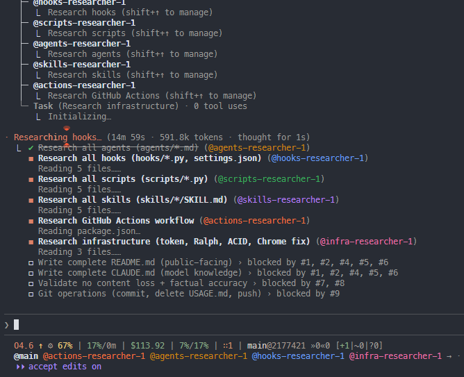

# Claude Code Configuration



Production [Claude Code](https://docs.anthropic.com/en/docs/claude-code) configuration with multi-agent orchestration, autonomous development workflows, and defense-in-depth safety layers.

## Features

| Category | Count | Highlights |
|----------|-------|------------|
| Skills | 17 | `/start`, `/review`, `/commit`, `/openpr`, `/x`, `/repotodo`, `/token`, and more |
| Agents | 25 | Specialist (Opus), reviewer (Sonnet), ops (Sonnet), git coordinator (Haiku) |
| Hooks | 14 | Security gate, auto-allow, change tracking, Ralph orchestration, ACID state |
| Scripts | 30+ | Token management, Chrome MCP fix, statusline, session repair, PR aggregation |
| Safety | 7 layers | Push gate, VERIFY+FIX, security hooks, budget guard, ACID transactions |
| Model Routing | 3 layers | Global default, skill fork, per-agent override for cost optimization |

## Quick Start

```bash
# 1. Clone
git clone https://github.com/bosmadev/claude.git ~/.claude

# 2. Run Claude Code — auto-generates .claude.json on first launch
claude

# 3. Configure settings.json — replace %USERPROFILE% with your home directory
#    Edit ~/.claude/settings.json for hook paths and permissions

# 4. Install Python dependencies
uv pip install portalocker
```

> **Note:** `.claude.json.example` is a **reference template only** — Claude Code auto-generates `.claude.json` on first run. Do not copy the example file.

---

## Skills Reference

### /start - Ralph Autonomous Development

| Command | Description |
|---------|-------------|
| `/start` | 3 agents, 3 iterations, Opus, plan mode |
| `/start [task]` | 3 agents, 3 iterations with task |
| `/start [N]` | N agents, 3 iterations |
| `/start [N] [M]` | N agents, M iterations |
| `/start [N] [M] [task]` | N agents, M iterations with task |
| `/start sonnet [task]` | Sonnet plan, Opus impl |
| `/start sonnet all [task]` | Sonnet ALL phases (budget mode) |
| `/start [N] [M] sonnet [task]` | N agents, M iter, Sonnet plan, Opus impl |
| `/start [N] [M] noreview [task]` | Skip post-implementation review |
| `/start [N] [M] review` | Review-only mode (entire codebase) |
| `/start [N] [M] review [path]` | Review-only mode (specific path) |
| `/start [N] [M] review [rN] [rM] [task]` | Custom review: rN agents, rM iterations |
| `/start [N] [M] import <source>` | Import from PRD/YAML/GitHub |
| `/start help` | Show usage |

All implementation agents must push their work to remote before completion (Push Gate enforcement).

### /review - Multi-Aspect Code Review

| Command | Description |
|---------|-------------|
| `/review` | 10 agents, 3 iter, Sonnet 4.5, working tree |
| `/review [N] [M]` | N agents, M iterations, Sonnet 4.5 |
| `/review [N] [M] opus` | N agents, M iterations, Opus 4.5 |
| `/review [N] [M] haiku` | N agents, M iterations, Haiku |
| `/review working` | Working tree only (R1 scope) |
| `/review impact` | Working tree + Serena impact radius (R2) |
| `/review branch` | Full branch diff since main (R3) |
| `/review pr [number]` | Review specific PR |
| `/review security` | Security-focused OWASP audit |
| `/review security --owasp` | Full OWASP Top 10 audit |
| `/review help` | Show usage |

### /commit - Git Commit Workflow

| Command | Description |
|---------|-------------|
| `/commit` | Generate pending-commit.md (scope: description) |
| `/commit confirm` | Execute pending commit + auto-cleanup |
| `/commit abort` | Cancel pending commit |
| `/commit show` | Show pending changes |
| `/commit clear` | Clear change log |
| `/commit help` | Show usage |

Uses single-file sections format with scope-prefix style. Organized by file path with bullet points of changes.

### /openpr - Create Pull Request

| Command | Description |
|---------|-------------|
| `/openpr` | Create PR to main |
| `/openpr [branch]` | Create PR to branch |
| `/openpr help` | Show usage |

Uses `scripts/aggregate-pr.py` for commit aggregation with build ID extraction. Does NOT automatically invoke `/review` — run review separately before PR creation.

### /init-repo - Initialize Repository for Claude Code

| Command | Description |
|---------|-------------|
| `/init-repo` | Interactive setup — prompts for each step |
| `/init-repo workflows` | Install GitHub workflows only |
| `/init-repo all` | Full setup (workflows + .gitignore) |
| `/init-repo help` | Show usage |

Installs `.github/workflows/claude.yml`, `.claude/` directory structure, and updated `.gitignore` with Claude patterns.

### /repotodo - Process TODO Comments by Priority

| Command | Description |
|---------|-------------|
| `/repotodo list` | List all TODOs by priority |
| `/repotodo P1 all` | Process all P1 (critical) TODOs |
| `/repotodo P1 all --verify` | Process all P1 TODOs + VERIFY+FIX agents |
| `/repotodo P1 [N]` | Process first N P1 TODOs |
| `/repotodo P2 all` | Process all P2 (high priority) TODOs |
| `/repotodo P2 all --verify` | Process all P2 + VERIFY+FIX agents |
| `/repotodo P3 all` | Process all P3 (medium priority) TODOs |
| `/repotodo P3 all --verify` | Process all P3 + VERIFY+FIX agents |
| `/repotodo low all` | Process all low priority (plain TODO:) |
| `/repotodo low all --verify` | Process all low + VERIFY+FIX agents |
| `/repotodo all` | Process ALL TODOs (P1 > P2 > P3 > low) |
| `/repotodo all --verify` | Process ALL + VERIFY+FIX agents |
| `/repotodo verify` | Check alignment: review findings vs source TODOs |
| `/repotodo verify --fix` | Verify + inject missing TODOs from findings |
| `/repotodo help` | Show usage |

TODO format: `TODO-P1:`, `TODO-P2:`, `TODO-P3:`, or plain `TODO:`

### /reviewplan - Process Plan USER Comments

| Command | Description |
|---------|-------------|
| `/reviewplan` | Process all USER comments in /plans/ |
| `/reviewplan [path]` | Process specific plan file |
| `/reviewplan help` | Show usage |

### /launch - Visual App Verification

| Command | Description |
|---------|-------------|
| `/launch` | Start server + visual verification |
| `/launch --only <browser>` | Single browser (chrome-mcp/playwriter/system) |
| `/launch help` | Show usage |

### /screen - Screenshot Management

| Command | Description |
|---------|-------------|
| `/screen` | Capture region screenshot |
| `/screen [N]` | Review last N screenshots |
| `/screen list` | List all with metadata |
| `/screen clean` | Delete screenshots older than 7 days |
| `/screen analyze [id]` | Analyze screenshot |
| `/screen delete [id]` | Delete screenshot |
| `/screen help` | Show usage |

### /youtube - Video Transcription

| Command | Description |
|---------|-------------|
| `/youtube <url>` | Transcribe video |
| `/youtube list` | List transcriptions |
| `/youtube delete <id>` | Delete transcription |
| `/youtube delete all` | Delete all |
| `/youtube help` | Show usage |

### /token - Claude GitHub Token Management

| Command | Description |
|---------|-------------|
| `/token` or `/token status` | Show token expiry and repo status |
| `/token refresh` | Refresh if expiring soon |
| `/token refresh --force` | Force refresh regardless of expiry |
| `/token sync` | Push token to current repo secrets |
| `/token sync all` | Push token to all detected repos |
| `/token help` | Show usage |

### /rule - Behavior Rule Management

| Command | Description |
|---------|-------------|
| `/rule add` | Add behavior rule via interactive TUI |
| `/rule list` | List all rules from settings.json |
| `/rule remove` | Remove rule pattern from settings.json |
| `/rule help` | Show usage |

Manages Claude Code behavior rules via direct `settings.json` modifications. Translates natural language rules into `permissions.deny` or `permissions.ask` patterns.

### /chats - Session Management

| Command | Description |
|---------|-------------|
| `/chats` or `/chats list` | List recent sessions with metadata |
| `/chats clean` | Clean orphaned session artifacts |
| `/chats help` | Show usage |

### /x - X/Twitter Outreach

| Command | Description |
|---------|-------------|
| `/x research {TOPIC}` | Explore X queries, rank by engagement |
| `/x research [N] [model] {TOPIC}` | N parallel agents for research |
| `/x post {TEXT with URL}` | Compose unique replies, post via Twikit API |
| `/x post [N] [model] {TEXT}` | N parallel agents for posting |
| `/x history` | Show posting history |
| `/x status` | Show daily/weekly counts + reach |
| `/x help` | Show usage |

Automated X/Twitter outreach. Claude dynamically searches, composes unique replies, and posts via Twikit API (1-2 sec/post) with Chrome MCP as fallback. Requires `skills/x/data/config.json` with `share_url`, `handle`, `project_name`, `project_desc`.

### /help - Help & Documentation

Shows available skills and usage information.

### /serena-workflow - Serena Tool Reference

Shows the complete Serena semantic code tools workflow and editing guide.

---

## Common Workflows

### Full Development Cycle

```
/start 10 3 [task description]
  -> Plan mode: Claude writes implementation plan
  -> Add USER: comments in plan file for feedback
  -> /reviewplan (repeat until satisfied)
  -> Approve plan
  -> 10 agents implement in parallel
  -> /review (post-implementation review)
  -> /commit
  -> /commit confirm
  -> /openpr
```

### Quick Fix

```
/start 3 2 [fix description]
  -> Plan + implement with 3 agents
  -> /commit
  -> /commit confirm
```

### Budget Mode (Sonnet)

```
/start 5 3 sonnet all [task]
  -> All phases use Sonnet 4.5 (cheaper)
  -> /commit
  -> /openpr
```

### Code Review Only

```
/review working         # Review uncommitted changes
/repotodo P1 all        # Fix critical TODOs
/commit
```

### Session Cleanup

```
/chats list             # See all sessions
/chats clean            # Clean orphaned artifacts
```

### Token Maintenance

```
/token status           # Check token expiry
/token refresh          # Refresh if needed
/token sync all         # Push to all repo secrets
```

---

## Statusline Guide

The custom statusline displays real-time session information in your terminal. Here's what each element means:

```
O4.6 ↑ ⚙ 42%  | 15%/287m | $1.23 | 5%/12% | ∷10 3/10:8O2S | main@a1b2c3 +2~1?3
```

### Elements

| Element | Example | Meaning |
|---------|---------|---------|
| **Model** | `O4.6` | Active model — O=Opus, S=Sonnet, H=Haiku, followed by version |
| **Effort** | `↑` | Effort level — `↑` High, `→` Med, `↓` Low (Opus only) |
| **Style** | `⚙` | Output style — `⚙` Engineer, `·` Default |
| **Context** | `42%` | Context window usage — green (<50%), yellow (<80%), red (80%+) |
| **Extended** | `/1M` | Suffix shown when using 1M extended context window |
| **Session Timer** | `15%/287m` | 5-hour session: usage percentage / minutes until reset |
| **Cost** | `$1.23` | Running session cost in USD |
| **Usage** | `5%/12%` | Sonnet weekly % / All models weekly % of quota |
| **Ralph** | `∷10 3/10:8O2S` | Team indicator: agent count, completed/total, model mix |
| **Git** | `main@a1b2c3` | Branch name @ short commit hash (clickable hyperlink) |
| **Git Status** | `+2~1?3` | `+` staged, `~` modified, `?` untracked file counts |
| **Git Remote** | `>>1<<2` | `>>` commits behind remote, `<<` commits ahead |

### Color Coding

| Color | Hex | Used For |
|-------|-----|----------|
| Salmon | `#d0886a` | Model name |
| Aurora Green | `#87a987` | Context (low usage), session timer |
| Aurora Yellow | `#e6c87a` | Context (medium usage), warnings |
| Aurora Red | `#b06060` | Context (high usage), errors |
| Grey | `#8a7e72` | Separators, secondary info |
| Snow White | `#d8d0c8` | Branch name |
| Cyan | `#d4956a` | Agent accent color |

### Ralph Section Details

When a Ralph team is active, the statusline shows:

| Part | Example | Meaning |
|------|---------|---------|
| `∷N` | `∷10` | Team indicator with agent count |
| `completed/total` | `3/10` | Tasks completed out of total |
| Model mix | `8O2S` | 8 Opus + 2 Sonnet agents |
| Struggle | `!!` | Alert when agents report difficulties |
| Build | `B11` | Current build number from CHANGELOG |

---

## Chrome MCP Fix (Windows)

Claude Code on Windows has a Chrome MCP integration issue where the auto-generated `chrome-native-host.bat` uses `claude.exe` (Bun standalone) which crashes on stdin piping.

### Problem

- Claude Code generates `chrome-native-host.bat` using the Bun standalone binary
- Bun cannot handle stdin piping required by Chrome's Native Messaging protocol
- Windows named pipe paths with spaces in usernames cause connection failures

### Solution

`scripts/fix-chrome-native-host.py` performs a 3-part fix:

1. **BAT rewrite** — Rewrites `chrome-native-host.bat` to use `node.exe` + `cli.js` instead of the Bun binary
2. **Pipe patch** — Patches `cli.js` `getSocketPaths()` to use `os.userInfo().username` for correct Windows named pipe paths
3. **Bridge disable** — Sets `tengu_copper_bridge: false` in `.claude.json` to force socket/pipe connection instead of broken WSS bridge

### Usage

Auto-runs as a `SessionStart` hook. For manual execution:

```bash
python ~/.claude/scripts/fix-chrome-native-host.py
```

After patching, restart your Claude Code session for the MCP server to load the updated `cli.js`.

---

## Architecture Overview

### Directory Structure

```
~/.claude/
├── .github/                    # GitHub templates and workflows
│   ├── PULL_REQUEST_TEMPLATE.md
│   ├── ISSUE_TEMPLATE/
│   └── workflows/claude.yml
├── agents/                     # Agent configuration files (25 files)
├── hooks/                      # Claude Code hook handlers (14 files)
├── output-styles/              # Response formatting styles
├── scripts/                    # CLI utilities (30+ scripts)
├── skills/                     # Skill definitions (16 skills)
├── plans/                      # Plan files from /start sessions
├── CLAUDE.md                   # Model knowledge (behavioral patterns)
├── settings.json               # Hook registrations and permissions
└── README.md                   # This file
```

### Hook System

Hooks intercept Claude Code events at different lifecycle stages:

| Stage | Examples | Purpose |
|-------|----------|---------|
| Setup/Stop | Token validation, symlink check | Session initialization and cleanup |
| SessionStart | Model capture, Ralph session init | Per-session setup |
| PreToolUse | Security gate, auto-allow, git safety | Block dangerous operations |
| PostToolUse | Change tracking, plan markers, insights | Track and validate edits |
| UserPromptSubmit | Skill parsing, plan comments | Intercept user commands |
| SubagentStart/Stop | Ralph orchestration | Track agent lifecycle |

### Agent Inventory

| Category | Count | Model | Examples |
|----------|-------|-------|----------|
| Specialist | 7 | Opus | Go, Next.js, Python, refactor, OWASP, verify-fix, coordinator |
| Reviewer | 13 | Sonnet | A11y, API, architecture, commit, database, docs, performance, security |
| Ops | 6 | Sonnet | Build error, E2E, DevOps, scraper, PR generator, plan verifier |
| Git | 1 | Haiku | Lightweight git coordinator |

### Ralph Autonomous Development

Ralph is the multi-agent orchestration system invoked via `/start`:

1. **Plan Phase** — Claude analyzes the task and writes an implementation plan
2. **User Review** — Add `USER:` comments in plan, run `/reviewplan` to iterate
3. **Implementation** — N agents work in parallel via native Agent Teams
4. **VERIFY+FIX** — Build/type/lint checks with auto-fix
5. **Review** — Sonnet agents review all changes (TODO-P1/P2/P3 comments)
6. **Git** — Dedicated git-coordinator commits and pushes

### Security Layers

| Layer | Component | What It Does |
|-------|-----------|-------------|
| 1 | `security-gate.py` | Validates Bash commands against allowlist |
| 2 | `sandbox-boundary.py` | Prevents writes outside project boundaries |
| 3 | `auto-allow.py` | Auto-approves safe Read/Edit operations |
| 4 | `guards.py` | Plan integrity, Ralph protocol enforcement |
| 5 | Push Gate | Agents must push before marking complete |
| 6 | VERIFY+FIX | Post-implementation build/type/lint checks |
| 7 | Budget Guard | Caps total spending per Ralph session |

---

## GitHub Actions

The `.github/workflows/claude.yml` workflow provides AI-assisted PR automation, code review, and security audits.

### Trigger Methods

| Trigger | How to Use |
|---------|-----------|
| `@claude review` comment | Comment on issue or PR |
| `@claude review` in PR review | Submit PR review with comment |
| Issue assigned to `claude[bot]` | Assign in GitHub UI |
| `claude` label | Add label to PR |
| PR opened | Automatic on every new PR |
| Manual dispatch | Actions tab UI |

### Manual Dispatch Actions

| Action | Purpose |
|--------|---------|
| Summarize changes in this PR | Generate structured PR summary |
| Review code quality | Style, patterns, bugs, test coverage |
| Security audit (OWASP) | OWASP Top 10 security check |
| Custom prompt | Your own question/task |

### Model Options

| Model | Use Case |
|-------|----------|
| `claude-sonnet-4-5-20250929` | Default — best speed/quality balance |
| `claude-sonnet-4-5-20250929[1m]` | 1M context for large PRs |
| `claude-opus-4-6` | Maximum reasoning and analysis |
| `claude-haiku-4-5-20251001` | Budget fallback, simple tasks |

### Required Secrets

| Secret | Required | How to Get |
|--------|----------|-----------|
| `CLAUDE_CODE_OAUTH_TOKEN` | Yes | `claude auth login` then `/token sync` |
| `GITHUB_TOKEN` | Auto | Provided automatically by GitHub |

### Token Sync

```bash
# Authenticate Claude CLI
claude auth login

# Sync token to repository
/token sync         # Current repo only
/token sync all     # All detected repos
```

### Workflow Permissions

```yaml
permissions:
  id-token: write       # OIDC authentication
  contents: write       # Read code, update files
  issues: write         # Comment on issues
  pull-requests: write  # Comment on PRs
  actions: read         # Read workflow status
```

### Cost Optimization

| Scenario | Recommended Model |
|----------|------------------|
| Dependency PRs | Haiku |
| Documentation | Sonnet |
| Large refactors (100+ files) | Sonnet[1m] |
| Architecture review | Opus (high effort) |
| Security audit | Opus (high effort) |
| Style checks | Haiku |

### Troubleshooting

```bash
# View workflow runs
gh run list --workflow=claude.yml

# View specific run logs
gh run view <run-id> --log

# Check token
gh secret list
```

If authentication errors occur: `claude auth login` then `/token sync`.

---

## Token Management

Token refresh uses defense-in-depth with 4 layers to survive laptop shutdown/sleep:

| Layer | Mechanism | Trigger |
|-------|-----------|---------|
| 1 | Task Scheduler | Every 30 minutes, "Start when available" |
| 2 | Resume Trigger | Power resume event |
| 3 | Login Profile | PowerShell profile load |
| 4 | Pre-op Check | Validates before Claude operations |

**Token lifetimes:** Access token ~2 hours, Refresh token ~1 year.

### Scripts

| Script | Purpose |
|--------|---------|
| `scripts/claude-github.py` | Main token management (status/refresh/sync) |
| `scripts/refresh-claude-token.py` | Task Scheduler wrapper (handles network wait) |
| `scripts/token-guard.py` | Pre-operation validation (Layer 4) |
| `scripts/install-token-timer.py` | Install Task Scheduler entries |

### Troubleshooting

| Issue | Solution |
|-------|---------|
| Token expired | `python ~/.claude/scripts/claude-github.py refresh --force` |
| Timer not running | `schtasks /Query /TN "ClaudeTokenRefresh"` |
| Manual refresh | `claude auth login` |
| Debug logs | Check `~/.claude/debug/token-refresh.log` |

---

## MCP Servers

| Server | Type | Purpose |
|--------|------|---------|
| `playwriter` | stdio | Browser automation via Playwright — auth flows, sessions, visual testing |
| `context7` | stdio | Up-to-date documentation and code examples for any library |
| `serena` | stdio | LSP-powered semantic code analysis — find symbols, rename, impact analysis |
| `claude-in-chrome` | stdio | Chrome DevTools integration — debug, inspect, console access |

Configured in `.claude.json` under `mcpServers`. See `.claude.json.example` for reference configuration.

---

## Configuration Files

| File | Purpose | Notes |
|------|---------|-------|
| `.claude.json` | Claude Code runtime config | Auto-generated on first run. **Do not copy** `.claude.json.example` |
| `.claude.json.example` | Reference template | Shows structure with sanitized values |
| `settings.json` | Hook registrations, permissions, env vars | Edit paths for your system |
| `.gitignore` | Git exclusions | Ignores sessions, cache, temp files |
| `CODEOWNERS` | GitHub code ownership | Requires owner approval for PRs |

---

## For Claude Code

See [CLAUDE.md](./CLAUDE.md) for model-specific behavioral patterns, conventions, and the complete hook registration table.
