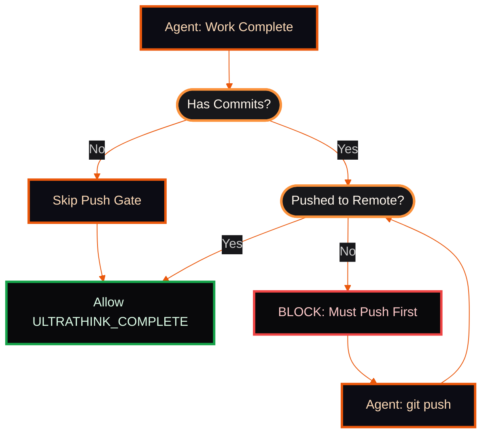

# Claude Code Usage Reference

**Parent:** [CLAUDE.md](./CLAUDE.md)
**Scope:** ~/.claude-specific commands, infrastructure, and tooling

---

## Skill Commands Reference

### /start - Ralph Autonomous Development

| Command                                    | Description                              |
| ------------------------------------------ | ---------------------------------------- |
| `/start`                                 | 3 agents, 3 iterations, Opus, plan mode  |
| `/start [task]`                          | 3 agents, 3 iterations with task         |
| `/start [N]`                             | N agents, 3 iterations                   |
| `/start [N] [M]`                         | N agents, M iterations                   |
| `/start [N] [M] [task]`                  | N agents, M iterations with task         |
| `/start sonnet [task]`                   | Sonnet plan → Opus impl                 |
| `/start sonnet all [task]`               | Sonnet ALL phases (budget mode)          |
| `/start [N] [M] sonnet [task]`           | N agents, M iter, Sonnet plan → Opus    |
| `/start [N] [M] noreview [task]`         | Skip post-implementation review          |
| `/start [N] [M] review [rN] [rM] [task]` | Custom review: rN agents, rM iterations  |
| `/start [N] [M] import <source>`         | Import from PRD/YAML/GitHub              |
| `/start help`                            | Show usage                               |

**Note:** All implementation agents must push their work to remote before completion. See [Layer 5: Push Gate](#layer-5-push-gate-must-push-before-completion) in Ralph Defense-in-Depth.

### /review - Multi-Aspect Code Review

| Command                           | Description                                |
| --------------------------------- | ------------------------------------------ |
| `/review`                       | 10 agents, 3 iter, Sonnet 4.5, working tree |
| `/review [N] [M]`               | N agents, M iterations, Sonnet 4.5         |
| `/review [N] [M] opus`          | N agents, M iterations, Opus 4.5           |
| `/review [N] [M] haiku`         | N agents, M iterations, Haiku              |
| `/review working`               | Working tree only (R1)                     |
| `/review impact`                | Working tree + Serena impact radius (R2)   |
| `/review branch`                | Full branch diff since main (R3)           |
| `/review pr [number]`           | Review specific PR                         |
| `/review security`              | Security-focused OWASP audit               |
| `/review security --owasp`      | Full OWASP Top 10 audit                    |
| `/review help`                  | Show usage                                 |

### /commit - Git Commit Workflow (scope-prefix style)

| Command             | Description                                    |
| ------------------- | ---------------------------------------------- |
| `/commit`         | Generate pending-commit.md (scope: description) |
| `/commit confirm` | Execute pending commit + auto-cleanup          |
| `/commit abort`   | Cancel pending commit                          |
| `/commit show`    | Show pending changes                           |
| `/commit clear`   | Clear change log                               |
| `/commit help`    | Show usage                                     |

**Commit Structure:** Uses single-file sections format with scope-prefix style:
- Organized by file path (e.g., `### src/components/Button.tsx`)
- Each section includes bullet points of changes
- Generates concise commit message: `scope: description`

### /openpr - Create Pull Request

| Command              | Description         |
| -------------------- | ------------------- |
| `/openpr`          | Create PR to main   |
| `/openpr [branch]` | Create PR to branch |
| `/openpr help`     | Show usage          |

**Integration:** Uses `scripts/aggregate-pr.py` for commit aggregation with build ID extraction.

**Note:** `/openpr` does NOT automatically invoke `/review`. These are separate concerns:
- Use `/review working` or `/review branch` BEFORE running `/openpr` if you want pre-merge review
- `/openpr` focuses solely on PR creation with commit aggregation
- Post-merge review happens via GitHub Actions workflow if configured

### /init-repo - Initialize Repository for Claude Code

| Command                | Description                              |
| ---------------------- | ---------------------------------------- |
| `/init-repo`         | Interactive setup - prompts for each     |
| `/init-repo workflows` | Install GitHub workflows only          |
| `/init-repo all`     | Full setup (workflows + .gitignore)      |
| `/init-repo help`    | Show usage                               |

**Installs:** From `~/.claude/.github/workflows/` including:
- `.github/workflows/claude.yml` - PR automation, changelog, validation
- `.claude/` directory structure
- Updated `.gitignore` with Claude patterns

**Workflow Integration:** Sets up automated CHANGELOG generation via GitHub Actions. See [CHANGELOG Automation](./CLAUDE.md#changelog-automation) for details.

### /repotodo - Process TODO Comments by Priority

| Command                        | Description                                      |
| ------------------------------ | ------------------------------------------------ |
| `/repotodo list`             | List all TODOs by priority                       |
| `/repotodo P1 all`           | Process all P1 (critical) TODOs                  |
| `/repotodo P1 all --verify`  | Process all P1 TODOs + VERIFY+FIX agents         |
| `/repotodo P1 [N]`           | Process N P1 TODOs                               |
| `/repotodo P2 all`           | Process all P2 (high priority) TODOs             |
| `/repotodo P2 all --verify`  | Process all P2 TODOs + VERIFY+FIX agents         |
| `/repotodo P3 all`           | Process all P3 (medium priority) TODOs           |
| `/repotodo P3 all --verify`  | Process all P3 TODOs + VERIFY+FIX agents         |
| `/repotodo low all`          | Process all low priority (plain TODO:)           |
| `/repotodo low all --verify` | Process all low TODOs + VERIFY+FIX agents        |
| `/repotodo all`              | Process ALL TODOs (P1 → P2 → P3 → low)        |
| `/repotodo all --verify`     | Process ALL TODOs + VERIFY+FIX agents            |
| `/repotodo verify`           | Check alignment: review findings vs source TODOs |
| `/repotodo verify --fix`     | Verify + inject missing TODOs from findings      |
| `/repotodo help`             | Show usage                                       |

**TODO Format:** `TODO-P1:`, `TODO-P2:`, `TODO-P3:`, or plain `TODO:`

**VERIFY+FIX Phase:** When `--verify` flag is used, runs VERIFY+FIX agents after processing TODOs to catch issues introduced during fixes. Reuses `agents/verify-fix.md` configuration with auto-fix for simple issues and AskUserQuestion escalation for complex problems.

### /reviewplan - Process Plan USER Comments

| Command                | Description                          |
| ---------------------- | ------------------------------------ |
| `/reviewplan`        | Process all USER comments in /plans/ |
| `/reviewplan [path]` | Process specific plan file           |
| `/reviewplan help`   | Show usage                           |

### /launch - Visual App Verification

| Command                      | Description                                          |
| ---------------------------- | ---------------------------------------------------- |
| `/launch`                  | Start server + visual verification                   |
| `/launch --only <browser>` | Single browser (chrome-mcp/playwriter/system) |
| `/launch help`             | Show usage                                           |

### /screen - Screenshot Management

| Command                  | Description               |
| ------------------------ | ------------------------- |
| `/screen`              | Capture region screenshot |
| `/screen [N]`          | Review last N screenshots |
| `/screen list`         | List all with metadata    |
| `/screen clean`        | Delete >7 days old        |
| `/screen analyze [id]` | Analyze screenshot        |
| `/screen delete [id]`  | Delete screenshot         |
| `/screen help`         | Show usage                |

### /youtube - Video Transcription

| Command                  | Description          |
| ------------------------ | -------------------- |
| `/youtube <url>`       | Transcribe video     |
| `/youtube list`        | List transcriptions  |
| `/youtube delete <id>` | Delete transcription |
| `/youtube delete all`  | Delete all           |
| `/youtube help`        | Show usage           |

### /token - Claude GitHub Token Management

| Command                         | Description                        |
| ------------------------------- | ---------------------------------- |
| `/token` or `/token status` | Show token expiry and repo status  |
| `/token refresh`              | Refresh if expiring soon           |
| `/token refresh --force`      | Force refresh regardless of expiry |
| `/token sync`                 | Push token to current repo secrets |
| `/token sync all`             | Push token to all detected repos   |
| `/token help`                 | Show usage                         |

### /rule - Behavior Rule Management

| Command              | Description                                  |
| -------------------- | -------------------------------------------- |
| `/rule add`        | Add behavior rule via AskUserQuestion TUI    |
| `/rule list`       | List all rules from settings.json            |
| `/rule remove`     | Remove rule pattern from settings.json       |
| `/rule help`       | Show usage                                   |

**Purpose:** Manage Claude Code behavior rules via direct `settings.json` modifications. Translates natural language rules into `permissions.deny` or `permissions.ask` patterns.

**Example Workflow:**
```
/rule add
  → AskUserQuestion: "What type of rule?"
  → User: "Block bash command"
  → AskUserQuestion: "Describe the rule"
  → User: "Never use rm -rf"
  → AskUserQuestion: "Adding rule to BLOCK: Bash(rm -rf:*). Accept?" [Yes/No]
  → Writes to ~/.claude/settings.json
```

**No Extra Files:** Rules are stored directly in `settings.json` under `permissions.deny` or `permissions.ask` - no separate `behavior-rules.json` needed.

---

## Model Routing Reference

Complete routing matrix for all Claude Code components. See CLAUDE.md "3-Layer Model Routing" for architecture.

| Component | Model | Effort | Context | Budget | Layer | Notes |
|-----------|-------|--------|---------|--------|-------|-------|
| `/start` main | Opus 4.6 | ↑ High | 200K | Opus | — | Complex orchestration |
| `/start` impl agents | Opus 4.6 | ↑ High | 200K | Opus | L3 | Task(model="opus") override |
| `/start` plan agents | Opus 4.6 | → Med | 200K | Opus | L3 | Planning phase |
| `/start sonnet` plan | Sonnet 4.5 | N/A | 200K | Sonnet | L3 | Budget-mode planning |
| `/review` main | Opus 4.6 | → Med | 200K | Opus | — | Orchestration only |
| `/review` agents | Sonnet 4.5 | N/A | 1M | Sonnet | L3 | Read-only, [1m] context |
| `/repotodo` | Opus 4.6 | ↑ High | 200K | Opus | — | Critical code changes |
| `/reviewplan` | Opus 4.6 | → Med | 200K | Opus | — | Plan edits only |
| `/commit` | Sonnet 4.5 | N/A | 200K | Sonnet | L2 | Fork, pattern matching |
| `/openpr` | Sonnet 4.5 | N/A | 200K | Sonnet | L2 | Fork, read commits |
| `/screen` | Sonnet 4.5 | N/A | 200K | Sonnet | L2 | Fork, screenshots |
| `/youtube` | Sonnet 4.5 | N/A | 200K | Sonnet | L2 | Fork, transcription |
| `/launch` | Sonnet 4.5 | N/A | 200K | Sonnet | L2 | Fork, browser |
| `/token` | Haiku 4.5 | N/A | 200K | Haiku | L2 | Fork, token mgmt |
| `/rule` | Sonnet 4.5 | N/A | 200K | Sonnet | L2 | Fork, settings |
| `/init-repo` | Sonnet 4.5 | N/A | 200K | Sonnet | L2 | Fork, templates |
| VERIFY+FIX scoped | Opus 4.6 | → Med | 200K | Opus | — | Per-task checks |
| VERIFY+FIX full | Opus 4.6 | ↑ High | 200K | Opus | — | Final gate |
| VERIFY+FIX plan | Opus 4.6 | → Med | 200K | Opus | — | Plan checks |
| Post-review agents | Sonnet 4.5 | N/A | 1M | Sonnet | L3 | Read-only review |
| Ralph impl agents | Opus 4.6 | ↑ High | 200K | Opus | L3 | Task(model="opus") |
| Ralph work-stealing | Opus 4.6 | ↑ High | 200K | Opus | L3 | Same as impl |
| Ralph retry queue | Opus 4.6 | ↑ High | 200K | Opus | L3 | Retries need best quality |
| GH Actions (auto PR) | Sonnet 4.5 | N/A | 200K | Sonnet | — | Default trigger |
| GH Actions: Summarize | Sonnet 4.5 | N/A | 1M | Sonnet | — | Large PRs, [1m] |
| GH Actions: Review | Sonnet 4.5 | N/A | 1M | Sonnet | — | Full repo context |
| GH Actions: Security | Opus 4.6 | → Med | 200K | Opus | — | OWASP depth |
| GH Actions: Custom | User picks | User picks | Varies | Varies | — | workflow_dispatch |
| GH Actions: Scheduled | Haiku 4.5 | N/A | 200K | Haiku | — | Health checks (future) |
| Specialist agents .md (7) | opus | — | — | — | .md | go, nextjs, python, refactor, verify-fix, owasp, coordinator |
| Review agents .md (10) | sonnet | — | — | — | .md | a11y, api, arch, commit, db, doc, perf, secret, security |
| Simple/ops agents .md (6) | sonnet | — | — | — | .md | build-error, e2e, devops, scraper, pr-gen, plan-verify |
| Git coordinator .md (1) | haiku | — | — | — | .md | Lightweight git ops |

**Legend:**
- **Effort:** ↓ Low, → Med, ↑ High (Opus only)
- **Layer:** L1 = Global default, L2 = Skill fork, L3 = Per-agent override, .md = Agent config
- **Budget:** Separate token budgets for Sonnet vs Opus (Sonnet ~17%, Opus ~38%)
- **[1m]:** Extended 1M context window for large file review

---

## Infrastructure

### Token Refresh (4-Layer Defense)

Token refresh uses defense-in-depth with 4 layers to survive laptop shutdown/sleep:

```
┌─────────────────────────────────────────────────────────────────┐
│                     TOKEN REFRESH LAYERS                        │
├─────────────────────────────────────────────────────────────────┤
│ Layer 1: Task Scheduler  → Every 30 min, "Start when available" │
│ Layer 2: Resume Trigger   → Power resume event trigger          │
│ Layer 3: Login Profile    → Check on PowerShell profile load    │
│ Layer 4: Pre-op Check     → Validates before Claude operations  │
└─────────────────────────────────────────────────────────────────┘
```

**Token Lifetimes:**

- Access token: ~2 hours
- Refresh token: ~1 year

**Morning Workflow:**

1. Wake from sleep → Layer 2 triggers refresh (5s delay for network)
2. Open PowerShell → Layer 3 runs background check via profile
3. Start Claude → Layer 4 validates before first operation
4. Task Scheduler catches up → Layer 1 continues 30-min cycle

**Scripts:**

| Script                              | Purpose                                           |
| ----------------------------------- | ------------------------------------------------- |
| `scripts\claude-github.py`        | Main token management (status/refresh/sync)       |
| `scripts\refresh-claude-token.py` | Wrapper for Task Scheduler (handles network wait) |
| `scripts\token-guard.py`          | Pre-operation validation (Layer 4)                |
| `scripts\install-token-timer.py`  | Install Task Scheduler entries                    |
| `scripts\compat.py`               | Cross-platform compatibility utilities            |
| `scripts\setup-tmpdir.py`         | Initialize temporary directory structure          |

**Troubleshooting:**

| Issue               | Solution                                                                        |
| ------------------- | ------------------------------------------------------------------------------- |
| Token expired       | Run:`python C:\Users\Dennis\.claude\scripts\claude-github.py refresh --force` |
| Timer not running   | Check:`schtasks /Query /TN "ClaudeTokenRefresh"`                              |
| Resume hook missing | Run:`schtasks /Create /TN "ClaudeTokenResume" /SC ONEVENT /EC System`         |
| Manual refresh      | Run:`claude auth login`                                                       |
| Debug logs          | View:`%USERPROFILE%\.claude\debug\token-refresh.log`                          |
| Check all layers    | Run:`schtasks /Query /TN "ClaudeToken*"`                                      |

### Web Research Fallback Chain

When fetching web content (research, scouting, documentation), use this fallback chain:

```
1. WebFetch(url)              → Fast, public URLs
2. Playwriter navigate        → If auth/session needed
3. claude-in-chrome            → Debug/inspect via DevTools
```

#### Browser Selection

| Scenario            | Browser          |
| ------------------- | ---------------- |
| Simple public page  | WebFetch         |
| Requires login/auth | Playwriter       |
| Debug/inspect       | claude-in-chrome |

**For subagents fetching web content:** Always include this fallback chain in prompts.

#### Browser Capability Matrix

| Browser          | Auth | CDP | Best For              |
| ---------------- | ---- | --- | --------------------- |
| WebFetch         | No   | No  | Simple public pages   |
| Playwriter MCP   | Yes  | Yes | Auth flows, sessions  |
| claude-in-chrome | Yes  | Yes | DevTools, inspection  |

**Note:** Serena is for CODE ANALYSIS only - NOT a browser. Ralph hooks/scripts and skills MUST use Serena for semantic code operations.

### Work-Stealing Queue

Ralph agents use atomic task claiming to prevent idle agents:

```python
# In ralph.py - atomic task claiming with file lock
def claim_next_task(agent_id: str) -> Optional[Task]:
    with FileLock(".claude/ralph/queue.lock"):
        queue = load_queue()
        for task in queue:
            if task.status == "pending" and not task.claimed_by:
                task.claimed_by = agent_id
                task.status = "in_progress"
                save_queue(queue)
                return task
    return None
```

Queue file location: `{project}/.claude/task-queue-{plan-id}.json`

### Ralph Defense-in-Depth

```
┌─────────────────────────────────────────────────────────────────┐
│                     DEFENSE IN DEPTH (6 LAYERS)                 │
├─────────────────────────────────────────────────────────────────┤
│ Layer 1: External Script → Orchestrates loop, creates state     │
│ Layer 2: Skill → Invokes script, spawns agents                  │
│ Layer 3: Hook  → Validates protocol, injects reminders          │
│ Layer 4: Context → Always-visible protocol rules                │
│ Layer 5: Push Gate → MUST push before completion allowed        │
│ Layer 6: Exit  → Validates completion signals                   │
└─────────────────────────────────────────────────────────────────┘
```

#### Layer 5: Push Gate (Must Push Before Completion)

Ralph agents MUST push their work to remote before signaling completion. This prevents:

- Lost work from uncommitted/unpushed changes
- Orphaned local branches that never reach the repository
- Silent failures where agents claim success but work is stranded

**Enforcement Flow:**



**Agent Requirements:**

1. Before emitting `ULTRATHINK_COMPLETE`, verify:

   - All changes are committed
   - All commits are pushed to remote branch
   - Use `git status` and `git log origin/branch..HEAD` to check
2. If unpushed commits exist:

   - Push to remote: `git push -u origin <branch>`
   - Only then signal completion
3. Hook validation (`ralph.py`):

   - Checks for unpushed commits on completion signal
   - Blocks completion if push required
   - Injects reminder to push first

**Exception:** Read-only agents (reviewers, analyzers) that make no commits bypass this gate.

#### Layer 7: VERIFY+FIX Phase

After implementation agents complete, VERIFY+FIX agents run before review:

```
PLAN → IMPLEMENT → VERIFY+FIX → REVIEW → COMPLETE
```

**VERIFY+FIX agents:**
- Run build checks, type checks, lint
- Use Serena for symbol integrity verification
- Auto-fix simple issues (imports, types, formatting)
- Escalate complex issues via AskUserQuestion
- Do NOT leave TODO comments — fix or escalate
- Config: `agents/verify-fix.md`

### Hook Registration Table

All hooks registered in `settings.json`:

| Hook Event | Matcher | Handler | Timeout | Phase | Purpose |
|-----------|---------|---------|---------|-------|---------|
| Setup | - | `token-guard.py check` | 60s | 1 | Validate Claude token before session |
| Setup | - | `setup.py validate-symlinks` | 30s | 1 | Verify symlink integrity |
| Stop | - | `ralph.py stop` | 30s | 1 | Cleanup Ralph state |
| Stop | - | `claudeChangeStop.js` | 5s | 1 | Save session state |
| SessionStart | startup\|resume | `utils.py model-capture` | 5s | 2 | Capture model ID for session |
| SessionStart | - | `ralph.py session-start` | 10s | 1 | Initialize Ralph session |
| PreCompact | - | `ralph.py pre-compact` | 10s | 1 | Save Ralph state before compaction |
| PreToolUse | Read | `auto-allow.py` | 5s | 1 | Auto-approve safe Read operations |
| PreToolUse | Bash | `security-gate.py pre-bash` | 5s | 1 | Security validation for Bash commands |
| PreToolUse | Bash | `git.py pre-commit-checks` | 5s | 1 | Git safety checks before commits |
| PreToolUse | MultiEdit\|Edit\|Write | `auto-allow.py` | 5s | 1 | Auto-approve safe edits |
| PreToolUse | MultiEdit\|Edit\|Write | `claudeChangePreToolUse.js` | 5s | 1 | Track file changes |
| PreToolUse | Task | `ralph.py hook-pretool` | 10s | 1 | Ralph task orchestration prep |
| PostToolUse | Bash | `git.py command-history` | 5s | 1 | Track git command history |
| PostToolUse | Edit\|Write | `git.py change-tracker` | 5s | 1 | Log file changes for commits |
| PostToolUse | Edit\|Write | `guards.py guardian` | 5s | 1 | Validate edit safety |
| PostToolUse | Edit\|Write | `guards.py plan-write-check` | 5s | 1 | Enforce plan change markers |
| PostToolUse | Edit\|Write | `guards.py insights-reminder` | 5s | 1 | Remind to update insights |
| PostToolUse | ExitPlanMode | `guards.py ralph-enforcer` | 10s | 1 | Validate Ralph protocol on plan exit |
| PostToolUse | Task | `ralph.py agent-tracker` | 10s | 1 | Track agent progress |
| PostToolUse | Skill | `guards.py skill-validator` | 5s | 1 | Validate skill invocation |
| PostToolUse | Skill | `post-review.py hook` | 30s | 2 | Post-review processing |
| UserPromptSubmit | ^/(?!start) | `guards.py skill-interceptor` | 5s | 1 | Parse skill commands |
| UserPromptSubmit | ^/start | `guards.py skill-parser` | 5s | 1 | Parse /start command args |
| UserPromptSubmit | - | `guards.py plan-comments` | 5s | 1 | Detect USER comments in plans |
| UserPromptSubmit | - | `guards.py auto-ralph` | 5s | 1 | Auto-trigger Ralph for complex tasks |
| SubagentStart | - | `ralph.py hook-subagent-start` | 10s | 3 | Initialize subagent context |
| SubagentStop | - | `ralph.py hook-subagent-stop` | 10s | 3 | Cleanup subagent state |
| Notification | permission_prompt | `utils.py notify` | 10s | 1 | Desktop notifications |

**Note:** All hooks with Phase 1 are critical path; Phase 2+ may run asynchronously.

### Agent Frontmatter Fields

Agent config files (`agents/*.md`) support these frontmatter fields:

| Field | Type | Description |
|-------|------|-------------|
| `name` | string | Agent identifier (required) |
| `specialty` | string | Domain specialty for auto-assignment |
| `disallowedTools` | list | Tools this agent cannot use (reviewers: `[Write, Edit, MultiEdit]`) |
| `description` | string | When to invoke this agent |

**Auto-assignment:** `match_agent_to_task()` in ralph.py scores tasks against `AGENT_SPECIALTIES` keyword lists to assign the best-fit agent config.

### Performance Tracking

Ralph tracks per-agent metrics via `PerformanceTracker`:

| Metric | Description |
|--------|-------------|
| `cost_usd` | API cost per agent |
| `num_turns` | API round-trips per agent |
| `duration_seconds` | Wall-clock time per agent |
| `avg_cost_per_agent` | Mean cost across completed agents |

Progress file: `.claude/ralph/progress.json` (includes `performance` summary)

### Budget Guard

Use `--budget` flag to cap total spending:

```bash
ralph.py loop 10 3 --budget 5.00 "Implement feature"
```

When cumulative cost exceeds the budget, remaining agents are skipped with `BUDGET` status.

---

## GitHub Actions Workflow

The `.github/workflows/claude.yml` workflow provides AI-assisted PR automation, code review, and security audits.

### Trigger Methods

| Trigger | How to Use | Example |
|---------|-----------|---------|
| `@claude review` comment | Comment on issue/PR | "@claude review this change" |
| `@claude review` in PR review | Submit PR review | "@claude review is this secure?" |
| Issue assigned to `claude[bot]` | Assign in GitHub UI | Assigns Claude as reviewer |
| `claude` label | Add label to PR | Auto-triggers on label |
| PR opened | Automatic | Runs on every new PR |
| Manual dispatch | Actions tab UI | Select action from dropdown |

### Manual Dispatch Actions

Use the GitHub Actions tab to run these on-demand:

| Action | Purpose | Use Case |
|--------|---------|----------|
| **Summarize changes in this PR** | Generate structured PR summary | Before review, after multiple commits |
| **Review code quality** | Style, patterns, bugs, test coverage | Pre-merge validation |
| **Security audit (OWASP)** | OWASP Top 10 security check | Security-critical PRs |
| **Custom prompt** | Your own question/task | Ad-hoc analysis |

### Configuration Options

| Parameter | Default | Purpose |
|-----------|---------|---------|
| `model` | `claude-sonnet-4-5-20250929` | AI model (see Model Options below) |
| `effort` | `high` | Effort level for Opus models (high/medium/low) |
| `max_turns` | 25 | Conversation length limit |
| `timeout` | 30 minutes | Workflow timeout |

#### Model Options

| Model | Purpose | Use Case |
|-------|---------|----------|
| `claude-sonnet-4-5-20250929` | Default - best speed/quality balance | Most PRs, general review |
| `claude-sonnet-4-5-20250929[1m]` | 1M context for large PRs | Multi-file refactors, large diffs |
| `claude-opus-4-6` | Maximum reasoning and analysis | Complex architecture, critical security |
| `claude-haiku-4-5-20251001` | Budget fallback, simple tasks | Dependency updates, style checks |

**Note:** The `effort` parameter only affects Opus models. It controls the depth of reasoning: `high` for thorough analysis, `medium` for balanced review, `low` for quick checks.

### Required Secrets

Set in repository Settings > Secrets and variables > Actions:

| Secret | Required | How to Get |
|--------|----------|-----------|
| `CLAUDE_CODE_OAUTH_TOKEN` | Yes | Run `claude auth login` then `/token sync` |
| `GITHUB_TOKEN` | Auto | Provided automatically by GitHub |

**Token Sync Workflow:**

```bash
# 1. Authenticate Claude CLI
claude auth login

# 2. Sync token to repository
cd your-repo
/token sync         # Current repo only
/token sync all     # All detected repos
```

### Workflow Permissions

Required GitHub permissions (already configured):

```yaml
permissions:
  id-token: write       # OIDC authentication
  contents: write       # Read code, update files
  issues: write         # Comment on issues
  pull-requests: write  # Comment on PRs
  actions: read         # Read workflow status
```

### MCP Servers Enabled

| Server | Purpose |
|--------|---------|
| `sequential-thinking` | Multi-step reasoning for complex analysis |
| `context7` | Documentation search and reference |

**Note:** Serena and Playwriter are intentionally excluded to prevent infinite loops in CI.

### Allowed Tools (Security-Restricted)

| Tool Category | Allowed |
|---------------|---------|
| MCP sequential-thinking | All |
| MCP context7 | All |
| Bash (safe commands) | gh, npm, pnpm, git, ls, cat, head, tail, tree, find, wc, grep, echo, pwd, mkdir, touch, cp, mv |
| File operations | Read, Write, Edit, MultiEdit |
| Search | Glob, Grep |
| Task orchestration | Task |

**Dangerous tools blocked:** rm, sudo, curl download, network access

### Usage Examples

**Comment-Based Triggers:**

```markdown
@claude explain this code block
@claude is this implementation secure?
@claude suggest improvements for performance
@claude refactor this function to be more readable
```

**PR Automation:**

```bash
# Create PR (Claude auto-triggers on PR open)
gh pr create --title "Add authentication" --body "WIP"

# Add label to trigger analysis
gh pr edit 42 --add-label "claude"

# Assign Claude for review
gh pr edit 42 --add-assignee "claude[bot]"
```

### Troubleshooting

**Workflow Not Triggering:**

```bash
# View workflow runs
gh run list --workflow=claude.yml

# View specific run logs
gh run view <run-id> --log
```

**Authentication Errors:**

1. Verify token: `gh secret list`
2. Refresh token: `claude auth login`
3. Sync to repo: `/token sync`
4. Check expiry: `/token status`

**Timeout Issues:**

- Increase timeout in workflow dispatch inputs
- Reduce `max_turns` for shorter conversations
- Use Haiku model for faster responses
- Break large tasks into smaller PRs

### Cost Optimization

| Scenario | Recommended Model | Rationale |
|----------|------------------|-----------|
| Dependency PRs | Haiku | Simple diffs, pattern matching |
| Documentation | Sonnet | Good balance |
| Large refactors (100+ files) | Sonnet[1m] | 1M context handles huge diffs |
| Architecture review | Opus (high effort) | Complex reasoning needed |
| Security audit | Opus (high effort) | Critical analysis |
| Style checks | Haiku | Fast, cheap, effective |
| Quick security scan | Opus (low effort) | Faster than high, still thorough |

### Advanced Configuration

**Multi-Repository Setup:**

```bash
# Sync token to all repositories
cd ~/.claude
/token sync all

# Verify sync
for repo in $(gh repo list --json name -q '.[].name'); do
  echo "Checking $repo..."
  gh secret list -R owner/$repo | grep CLAUDE
done
```

**Change AI Model:**

```yaml
--model claude-opus-4-5-20251101  # For complex reasoning
--model claude-haiku-4-5-20251001 # For faster/cheaper runs
```

**Adjust Conversation Length:**

```yaml
--max-turns 50  # Longer conversations
--max-turns 10  # Shorter, focused analysis
```

---

## Serena Semantic Code Tools

Serena provides LSP-powered semantic code analysis. **Prefer Serena tools over text-based alternatives** for code understanding and manipulation.

### When to Use Serena

| Task                           | Serena Tool                               | Instead of          |
| ------------------------------ | ----------------------------------------- | ------------------- |
| Find function/class by name    | `mcp__serena__find_symbol`              | `Grep`            |
| Get file structure overview    | `mcp__serena__get_symbols_overview`     | `Read` full file  |
| Find all callers of a function | `mcp__serena__find_referencing_symbols` | `Grep` for name   |
| Rename symbol across codebase  | `mcp__serena__rename_symbol`            | Multi-file `Edit` |
| Replace function body          | `mcp__serena__replace_symbol_body`      | `Edit` tool       |
| Insert code after symbol       | `mcp__serena__insert_after_symbol`      | `Edit` tool       |
| Search with code context       | `mcp__serena__search_for_pattern`       | `Grep`            |

### Serena Workflow

1. **Before reading files**: Use `mcp__serena__get_symbols_overview` to understand structure
2. **Finding code**: Use `mcp__serena__find_symbol` with `name_path_pattern`
3. **Impact analysis**: Use `mcp__serena__find_referencing_symbols` before modifying
4. **Editing symbols**: Use `mcp__serena__replace_symbol_body` (preserves formatting)
5. **Cross-file renames**: Use `mcp__serena__rename_symbol` (atomic, LSP-powered)

### Serena Memory

Use Serena memory for persistent project context:

| Tool                           | Purpose                                   |
| ------------------------------ | ----------------------------------------- |
| `mcp__serena__write_memory`  | Save architectural decisions, symbol maps |
| `mcp__serena__read_memory`   | Recall project context                    |
| `mcp__serena__list_memories` | See available memory files                |
| `mcp__serena__edit_memory`   | Update existing memory                    |

### Auto-Activation

Serena auto-activates on session start if `.serena/` config exists.
If not configured, run `mcp__serena__onboarding` once per project.

### Serena Think Tools

Use these checkpoints during complex tasks:

| Tool                                               | When to Use                 |
| -------------------------------------------------- | --------------------------- |
| `mcp__serena__think_about_collected_information` | After gathering context     |
| `mcp__serena__think_about_task_adherence`        | Before making changes       |
| `mcp__serena__think_about_whether_you_are_done`  | Before reporting completion |

---

## Agent Teams (In-Process)

Experimental feature enabling parallel Claude Code instances within a session.

### Configuration

Enabled via `settings.json`:
- `"CLAUDE_CODE_EXPERIMENTAL_AGENT_TEAMS": "1"` in env block

In-process mode only. Split-pane mode requires tmux (not available natively on Windows).

### Keyboard Shortcuts

| Shortcut | Action |
| -------- | ------ |
| `Shift+Tab` | Delegate mode (lead coordinates, no code) |
| `Shift+Up/Down` | Select teammate to message |
| `Ctrl+T` | Toggle task list |

### Cleanup Workflow

Manual cleanup required after team sessions:

1. Shut down each teammate: "Ask the {name} teammate to shut down"
2. Lead calls `TeamDelete()` to remove `~/.claude/teams/{name}/` and `~/.claude/tasks/{name}/`

### When to Use

| Scenario | Tool |
| -------- | ---- |
| Parallel research, multi-perspective reviews | Agent Teams |
| Implementation loops, VERIFY+FIX, push-gated | Ralph (`/start`) |
| Competing hypotheses, architecture exploration | Agent Teams |
| Sequential task execution with review | Ralph (`/start`) |

### Ralph Compatibility

- Teammates are full Claude Code instances (load CLAUDE.md, hooks, skills)
- Ralph hooks fire per-teammate (ralph.py, guards.py all execute)
- Task() subagents work inside teammates
- "No nested teams" = teammates can't spawn their OWN teams
- Token cost: each teammate = full instance — Ralph agents inside = expensive

### Limitations

- No session resumption after team ends
- One team per session
- No nested teams (teammates can't create sub-teams)
- Lead agent is fixed (can't change lead)

### Ralph → Agent Teams Migration (Future)

Ralph currently uses a custom hybrid system (file-based inbox, TeamConfig dataclass,
subprocess spawning). Native Agent Teams integration is planned in 3 phases:

| Phase | Change | Benefit | Complexity |
|-------|--------|---------|------------|
| 1 | Add SendMessage for progress | Real-time updates | Low |
| 2 | Replace file inbox with DMs | Eliminate file I/O | Medium |
| 3 | Full TeamCreate + TaskList | Named agents, shared tasks | High |

**Phase 3 triggers:** Native agent swarm primitives in Claude Code, user pain with
file relay, or TaskList performance for 50+ agents.

### Idle Notification Handling

**Note:** Message types (`idle_notification`, `task_completed`) are auto-delivered by the system. They are NOT hookable events — do not add them to settings.json hooks.

Agent Teams teammates send `idle_notification` JSON on every turn end.
For high-agent-count scenarios (Ralph), filter with:

- **Message filter**: Skip messages where `type == "idle_notification"`
- **Prompt suppression**: Include "Do NOT send idle notifications" in agent prompts
- **Summary mode**: Log idle notifications to file instead of displaying

---

## Auto Memory

Claude Code automatically persists learnings across conversations.

### How It Works

- **Directory:** `~/.claude/projects/{project}/memory/MEMORY.md`
- **System prompt injection:** First 200 lines of `MEMORY.md` are included in every system prompt
- **Topic files:** Create separate files (e.g., `debugging.md`, `patterns.md`) and link from MEMORY.md
- **Auto-updates:** Claude writes insights as it works — no manual config needed

### Best Practices

- Keep `MEMORY.md` concise (under 200 lines) — overflow goes to linked topic files
- Organize by topic, not chronologically
- Record: problem constraints, strategies that worked/failed, lessons learned
- Update or remove memories that become wrong or outdated

### vs Serena Memories

| Feature | Auto Memory | Serena Memory |
| ------- | ----------- | ------------- |
| Storage | `~/.claude/projects/*/memory/` | Serena's internal memory store |
| Scope | Per-project, auto-loaded | Per-project, manual read |
| Access | System prompt (always visible) | `mcp__serena__read_memory` |
| Write | `Edit`/`Write` tools | `mcp__serena__write_memory` |
| Use case | Quick-reference patterns | Detailed architectural notes |

Both systems are complementary — use Auto Memory for high-frequency patterns, Serena for deep architectural context.
